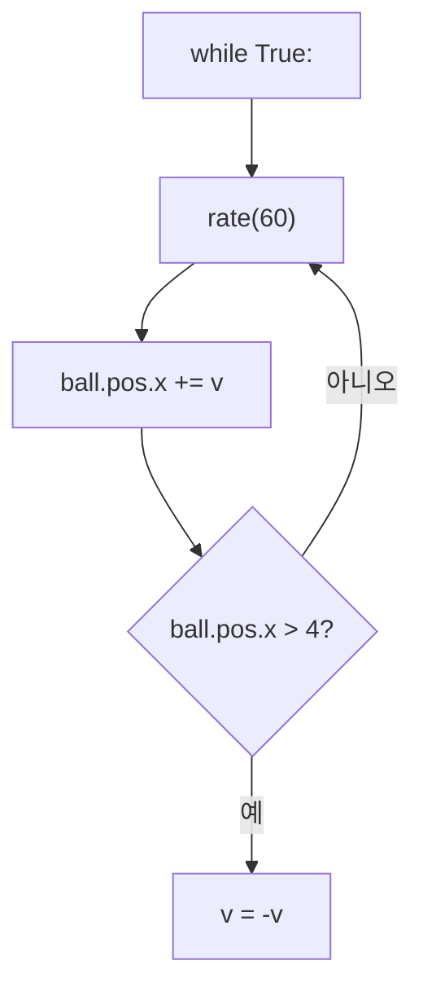

# VPython 사고력 교재 — 시각화 강화 계획

> **이 파일이 시각화 작업의 유일한 진실 공급원(Single Source of Truth)이다.**
> 새 세션에서는 이 파일 + Ch.1 샘플만 보면 바로 작업할 수 있다.

---

## 1. 시각화 유형 4가지

### A. GlowScript iframe — 3D 라이브 데모

학생이 마우스로 회전/확대할 수 있는 실제 3D 장면.

**사용 위치:**
- 🎬 오늘의 장면 — 첫 인상, "이걸 만들 거예요!"
- 🔄 역추적 챌린지 — "이 장면을 보고 코드를 작성하세요" (대상 장면)
- 📝 완성 코드 — 최종 결과물 확인

**HTML 템플릿** (`docs/demos/chXX_scene.html`):

```html
<div id="glowscript" class="glowscript">
<meta http-equiv="Content-Type" content="text/html; charset=utf-8">
<link type="text/css" href="https://www.glowscript.org/css/redmond/2.1/jquery-ui.custom.css" rel="stylesheet" />
<link type="text/css" href="https://www.glowscript.org/css/ide.css" rel="stylesheet" />
<script type="text/javascript" src="https://www.glowscript.org/lib/jquery/2.1/jquery.min.js"></script>
<script type="text/javascript" src="https://www.glowscript.org/lib/jquery/2.1/jquery-ui.custom.min.js"></script>
<script type="text/javascript" src="https://www.glowscript.org/package/glow.3.2.min.js"></script>
<script type="text/javascript" src="https://www.glowscript.org/package/RSrun.3.2.min.js"></script>
<script type="text/javascript"><!--//--><![CDATA[//><!--
;(function() {
function __main__() {
    // === 여기에 GlowScript JavaScript 코드 ===
}
;$(function(){ window.__context = { glowscript_container: $("#glowscript").removeAttr("id") }; __main__() })})()
//--><!]]></script>
</div>
```

**VPython → GlowScript JS 변환 규칙:**

| VPython | GlowScript JS |
|---------|---------------|
| `vector(x, y, z)` | `vec(x, y, z)` |
| `sphere(pos=vector(0,0,0), color=color.red)` | `sphere({pos: vec(0,0,0), color: color.red})` |
| `box(pos=..., size=...)` | `box({pos: ..., size: ...})` |
| `cylinder(pos=..., axis=..., radius=...)` | `cylinder({pos: ..., axis: ..., radius: ...})` |
| `cone(pos=..., axis=..., radius=...)` | `cone({pos: ..., axis: ..., radius: ...})` |
| `color.red` | `color.red` (동일) |
| `color.gray(0.5)` | `vec(0.5, 0.5, 0.5)` |
| `scene.background = vector(...)` | `var scene = canvas(); scene.background = vec(...)` |
| `a = sphere(...)` | `var a = sphere({...})` |
| `from random import uniform` | 불필요 (JS에서 `Math.random()` 사용) |
| `random()` | `Math.random()` |
| `uniform(a, b)` | `(Math.random() * (b-a) + a)` |
| `for x in range(5):` | `for (var x = 0; x < 5; x++) {` ... `}` |
| `def make_tree(x, z, h):` | `function make_tree(x, z, h) {` ... `}` |
| `while True:` | `while (true) { await rate(60);` ... `}` (비동기) |
| `rate(60)` | `await rate(60)` |
| `keysdown()` | `keysdown()` (동일) |
| `label(pos=..., text=...)` | `label({pos: ..., text: ...})` |
| `# 주석` | `// 주석` |

**비동기 처리 (while 루프 필요 시):**
```javascript
function __main__() {
    // ... 장면 설정 ...
    async function anim() {
        while (true) {
            await rate(60);
            // ... 움직임 코드 ...
        }
    }
    anim();
}
```

**챕터 마크다운에 삽입하는 형식:**
```markdown
<div class="glowscript-demo" markdown>
<div class="demo-label">실행 결과 — 장면 설명</div>
<iframe src="../demos/chXX_scene.html"></iframe>
</div>
```

### B. Mermaid 흐름도

프로그램 로직/흐름을 시각화. mkdocs.yml에 이미 설정됨.

**사용 위치:** 반복문/조건문/함수 흐름이 중요한 챕터의 📖 알고 넘어가기 또는 🔍 코드 읽기 챌린지

**형식:**
````markdown

````

### C. CSS 정적 미리보기

코드 실행 없이 결과를 보여주는 HTML/CSS 블록.

**사용 위치:**
- 🔍 코드 읽기 챌린지 — "이 코드의 결과는?" 미리보기
- 🔄 역추적 챌린지 — GlowScript iframe 대신 가벼운 대안

**3가지 하위 유형:**

**C-1. scene-preview** (어두운 배경 + 컬러 원/사각형):
```html
<div class="scene-preview">
  <div class="obj" style="left: 25%; top: 45%; width: 50px; height: 50px;
    background: radial-gradient(circle at 35% 35%, #ff6b6b, #c0392b);"></div>
</div>
```

**C-2. code-result** (코드 바로 아래 결과 설명):
```html
<div class="code-result" markdown>
**실행 결과**: 빨간 공이 왼쪽(-3)에, 파란 공이 오른쪽(3)에 나타납니다.
</div>
```

**C-3. SVG 다이어그램** (좌표계 등 커스텀):
```markdown

```

### D. 조합 사용 가능

한 챕터에서 여러 유형을 함께 사용할 수 있다:
- 🎬 → GlowScript iframe
- 🔍 → code-result + scene-preview
- 🔄 → GlowScript iframe 또는 scene-preview
- 📖 → Mermaid (해당 챕터만)
- 📝 → GlowScript iframe

---

## 2. 챕터별 시각화 계획

### 범례
- 🟢 정적 장면 (VPython→JS 단순 변환)
- 🟡 애니메이션 (while/rate 비동기 필요)
- 🔴 인터랙티브 (키보드/위젯 이벤트)
- 📐 Mermaid 흐름도 추가
- 🎨 CSS scene-preview 추가
- 📊 SVG 다이어그램 추가

### Ch.1 — VPython의 세계로! 🟢
- **🎬 오늘의 장면**: GlowScript iframe — 4색 공 나란히 (`ch01_scene.html`)
- **🔍 코드 읽기**: code-result 블록 (코드 아래 결과 설명)
- **🔄 역추적**: scene-preview (노란 공 + 큰 보라 공)
- **📝 완성 코드**: GlowScript iframe — 4색 공 (`ch01_final.html`, scene과 동일 가능)
- **데모 파일**: `ch01_scene.html`

### Ch.2 — 좌표의 비밀 🟢
- **🎬 오늘의 장면**: GlowScript iframe — 눈사람 (`ch02_scene.html`)
- **🔍 코드 읽기**: code-result 블록
- **🔄 역추적**: scene-preview (공 배치 문제)
- **📖 알고 넘어가기**: SVG 좌표계 다이어그램 (`images/coord-xyz.svg` — 이미 생성됨)
- **📝 완성 코드**: GlowScript iframe (`ch02_final.html`)
- **데모 파일**: `ch02_scene.html`, `ch02_final.html`

### Ch.3 — 다양한 물체 🟢
- **🎬 오늘의 장면**: GlowScript iframe — 놀이터 (`ch03_scene.html`)
- **🔍 코드 읽기**: code-result 블록
- **🔄 역추적**: scene-preview (로봇 역추적)
- **📝 완성 코드**: GlowScript iframe (`ch03_final.html`)
- **데모 파일**: `ch03_scene.html`, `ch03_final.html`

### Ch.4 — 변수와 계산 🟢
- **🎬 오늘의 장면**: GlowScript iframe — 탑 (`ch04_scene.html`)
- **🔍 코드 읽기**: code-result 블록
- **🔄 역추적**: scene-preview (변수로 만든 장면)
- **📝 완성 코드**: GlowScript iframe (`ch04_final.html`)
- **데모 파일**: `ch04_scene.html`, `ch04_final.html`

### Ch.5 — 랜덤의 마법 🟢
- **🎬 오늘의 장면**: GlowScript iframe — 밤하늘+꽃밭 (`ch05_scene.html`)
  - 특이사항: random() 사용 → 매번 다른 결과 (이것도 매력!)
- **🔍 코드 읽기**: code-result 블록
- **🔄 역추적**: scene-preview
- **📝 완성 코드**: GlowScript iframe (`ch05_final.html`)
- **데모 파일**: `ch05_scene.html`, `ch05_final.html`

### Ch.6 — 애니메이션 🟡
- **🎬 오늘의 장면**: GlowScript iframe — 3공 이동 (`ch06_scene.html`)
  - `while True` + `rate(60)` → 비동기 처리 필요
- **🔍 코드 읽기**: code-result 블록
- **📖 알고 넘어가기**: 📐 Mermaid 흐름도 (애니메이션 루프)
- **🔄 역추적**: code-result (움직임 설명)
- **📝 완성 코드**: GlowScript iframe (`ch06_final.html`)
- **데모 파일**: `ch06_scene.html`, `ch06_final.html`

### Ch.7 — if문 🟡
- **🎬 오늘의 장면**: GlowScript iframe — 벽 튕기기 (`ch07_scene.html`)
- **🔍 코드 읽기**: code-result 블록
- **📖 알고 넘어가기**: 📐 Mermaid 흐름도 (if 분기)
- **🔄 역추적**: code-result (공 움직임 추적)
- **📝 완성 코드**: GlowScript iframe (`ch07_final.html`)
- **데모 파일**: `ch07_scene.html`, `ch07_final.html`

### Ch.8 — 키보드 조종 🔴
- **🎬 오늘의 장면**: GlowScript iframe — 키보드 게임 (`ch08_scene.html`)
  - `keysdown()` → 인터랙티브
- **🔍 코드 읽기**: code-result 블록
- **🔄 역추적**: scene-preview
- **📝 완성 코드**: GlowScript iframe (`ch08_final.html`)
- **데모 파일**: `ch08_scene.html`, `ch08_final.html`

### Ch.9 — 충돌 감지 🔴
- **🎬 오늘의 장면**: GlowScript iframe — 충돌 게임 (`ch09_scene.html`)
  - 키보드 + 충돌 판정 + 점수
- **🔍 코드 읽기**: code-result 블록
- **📖 알고 넘어가기**: 📐 Mermaid (충돌 판정 로직)
- **🔄 역추적**: code-result (mag 계산)
- **📝 완성 코드**: GlowScript iframe (`ch09_final.html`)
- **데모 파일**: `ch09_scene.html`, `ch09_final.html`

### Ch.10 — 미니 프로젝트 🔴
- **🎬 오늘의 미션**: scene-preview (아이디어 3개 시각화) + code-result
- **📝 완성 예시**: GlowScript iframe — 예시 게임 (`ch10_final.html`)
- **데모 파일**: `ch10_final.html`

### Ch.11 — for 반복문 🟢
- **🎬 오늘의 장면**: GlowScript iframe — 5x5 격자 (`ch11_scene.html`)
- **🔍 코드 읽기**: code-result + scene-preview (1D 줄)
- **📖 알고 넘어가기**: 📐 Mermaid 흐름도 (for 루프)
- **🔄 역추적**: scene-preview (세로 줄, 격자)
- **📝 완성 코드**: GlowScript iframe (`ch11_final.html`, scene과 동일)
- **데모 파일**: `ch11_scene.html`

### Ch.12 — 리스트 🟡
- **🎬 오늘의 장면**: GlowScript iframe — 20공 튕기기 (`ch12_scene.html`)
  - for + list + while + rate → 비동기
- **🔍 코드 읽기**: code-result 블록
- **🔄 역추적**: scene-preview (공 5개 세로)
- **📝 완성 코드**: GlowScript iframe (`ch12_final.html`)
- **데모 파일**: `ch12_scene.html`, `ch12_final.html`

### Ch.13 — 함수 🟢
- **🎬 오늘의 장면**: GlowScript iframe — 50그루 숲 (`ch13_scene.html`)
  - def + for + random → 정적이지만 매번 다른 결과
- **🔍 코드 읽기**: code-result 블록
- **🔄 역추적**: scene-preview (공 3개)
- **📝 완성 코드**: GlowScript iframe (`ch13_final.html`, scene과 동일)
- **데모 파일**: `ch13_scene.html`

### Ch.14 — 위젯과 대시보드 🔴
- **🎬 오늘의 장면**: GlowScript iframe — 슬라이더+버튼 (`ch14_scene.html`)
  - slider(), button() → 인터랙티브 위젯
- **🔍 코드 읽기**: code-result 블록
- **🔄 역추적**: code-result (대시보드 설명)
- **📝 완성 코드**: GlowScript iframe (`ch14_final.html`)
- **데모 파일**: `ch14_scene.html`, `ch14_final.html`

### Ch.15 — 최종 프로젝트
- **🎬 오늘의 미션**: scene-preview (아이디어 시각화)
- 하위 페이지(15-1, 15-2, 15-3)에 각각 GlowScript iframe 가능
- **데모 파일**: 하위 프로젝트별 판단

---

## 3. 생성할 파일 목록

### GlowScript 데모 HTML (docs/demos/)

**1차 — 정적 장면 (7개):**
- `ch01_scene.html` — 4색 공 (이미 생성됨, 동작 확인됨)
- `ch02_scene.html` + `ch02_final.html` — 좌표 배치 / 눈사람
- `ch03_scene.html` + `ch03_final.html` — 다양한 물체 / 놀이터
- `ch04_scene.html` + `ch04_final.html` — 변수 / 탑
- `ch05_scene.html` + `ch05_final.html` — 랜덤 / 밤하늘
- `ch11_scene.html` — 5x5 격자
- `ch13_scene.html` — 50그루 숲

**2차 — 애니메이션 (4개):**
- `ch06_scene.html` + `ch06_final.html` — 공 이동
- `ch07_scene.html` + `ch07_final.html` — 벽 튕기기
- `ch12_scene.html` + `ch12_final.html` — 20공 튕기기

**3차 — 인터랙티브 (4개):**
- `ch08_scene.html` + `ch08_final.html` — 키보드 조종
- `ch09_scene.html` + `ch09_final.html` — 충돌 게임
- `ch10_final.html` — 미니 프로젝트 예시
- `ch14_scene.html` + `ch14_final.html` — 위젯 대시보드

### SVG 다이어그램 (docs/images/)
- `coord-xyz.svg` — 3D 좌표계 (이미 생성됨)
- 추가 SVG는 필요 시 생성

### CSS scene-preview 예시 패턴

**공 배치 (sphere):**
```html
<div class="scene-preview">
  <div class="obj" style="left: 25%; top: 45%; width: 40px; height: 40px;
    background: radial-gradient(circle at 35% 35%, #ff6b6b, #c0392b);"></div>
</div>
```

**상자 (box):**
```html
<div class="obj" style="left: 40%; top: 60%; width: 60px; height: 30px;
  border-radius: 4px;
  background: linear-gradient(135deg, #74b9ff, #2980b9);"></div>
```

**원기둥 (cylinder) — 세로:**
```html
<div class="obj" style="left: 50%; top: 30%; width: 20px; height: 60px;
  border-radius: 10px;
  background: linear-gradient(to right, #a0a0a0, #808080);"></div>
```

---

## 4. 작업 순서

### Phase A: 샘플 (Ch.1) ← 완료 후 기준이 됨
1. `ch01_scene.html` 생성 (완료됨)
2. `chapter01.md`에 시각화 삽입:
   - 🎬 오늘의 장면 → GlowScript iframe
   - 🔍 코드 읽기 → code-result 블록
   - 🔄 역추적 → scene-preview
   - 📝 완성 코드 → GlowScript iframe
3. 사용자 검토 → 피드백 반영

### Phase B: 정적 장면 (Ch.2~5, 11, 13)
- GlowScript HTML 생성 + 챕터에 삽입
- Ch.2는 SVG 좌표계도 삽입
- 병렬 실행 가능 (챕터별 독립)

### Phase C: 애니메이션 (Ch.6, 7, 12)
- 비동기 while 루프 패턴 적용
- Mermaid 흐름도도 함께 삽입 (Ch.6, 7)

### Phase D: 인터랙티브 (Ch.8, 9, 10, 14)
- 키보드/위젯 이벤트 처리
- Ch.9에 Mermaid 추가

### Phase E: 마무리
- Ch.15 하위 페이지
- 전체 빌드 검증
- 테스트 파일(visual_test.md) 제거
- 배포

---

## 5. 주의사항

- **scene과 final이 같은 경우**: 🎬과 📝의 코드가 동일하면 HTML 1개만 생성 (예: Ch.1, 11, 13)
- **scene과 final이 다른 경우**: 🎬이 시작 장면, 📝이 완성 장면이면 각각 생성 (예: Ch.2, 3)
- **역추적 GlowScript**: 역추적은 학생이 "보고 → 코드 작성"하는 것이므로, 장면이 복잡하면 GlowScript iframe, 단순하면 scene-preview로 충분
- **iframe 경로**: 챕터 페이지에서 `../demos/chXX_scene.html` (MkDocs 빌드 구조 기준)
- **Mermaid**: 해당 챕터에만 적용 (Ch.6, 7, 9, 11)
- **code-result**: 코드 블록 바로 아래에 배치, 줄바꿈 없이 붙여야 시각적으로 연결됨
- **기존 챕터 텍스트는 최소 수정**: 시각화 블록을 삽입만 하고, 기존 텍스트는 건드리지 않는다

---

*작성일: 2026-02-18*
*Ch.1 샘플 완성 후 나머지 Phase B~E 병렬 실행*
