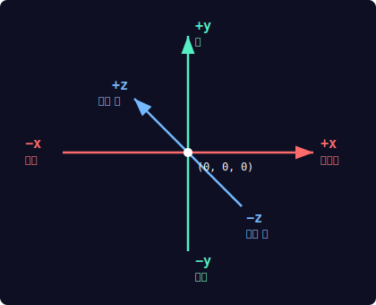

# Ch.2 — 좌표의 비밀

**Part 1: 3D 첫 걸음** | 핵심: `vector`, `pos`

---

## 🎬 오늘의 장면

여러분, 이 눈사람을 보세요!

하얀 눈밭 위에 서 있는 귀여운 눈사람. 둥근 몸통 위에 배, 머리가 차곡차곡 쌓여 있고, 까만 모자를 쓰고, 주황색 당근 코가 삐죽 나와 있습니다. 눈도 있고 단추도 있네요!

**이 눈사람, 코드로 만들 수 있습니다.**

<div class="glowscript-demo" markdown>
<div class="demo-label">마우스로 돌려보세요!</div>
<iframe src="../demos/ch02_scene.html"></iframe>
</div>

비결은 딱 하나 — **좌표**입니다. 물체를 "어디에" 놓을지 숫자 세 개로 알려주면, 3D 세계 어디든 정확하게 배치할 수 있습니다. 오늘이 끝나면 여러분도 이 눈사람을 뚝딱 만들 수 있게 됩니다!

---

## 🔍 코드 읽기 챌린지

아래 코드를 **실행하지 말고** 읽어 보세요. 머릿속으로 그림을 그려 봅시다.

```python
GlowScript 3.2 VPython

sphere(pos=vector(0, 0, 0), color=color.red)
sphere(pos=vector(3, 0, 0), color=color.blue)
sphere(pos=vector(0, 3, 0), color=color.green)
```

??? question "빨간 공은 어디에 있을까요?"

    `vector(0, 0, 0)` — 세 숫자가 모두 0입니다.
    이것은 3D 세계의 **한가운데**, 즉 **원점**입니다.
    빨간 공은 화면 정중앙에 나타납니다.

??? question "파란 공은 빨간 공에서 어느 방향일까요?"

    `vector(3, 0, 0)` — 첫 번째 숫자(x)만 3이고 나머지는 0입니다.
    x는 **좌우** 방향이고, 양수이면 **오른쪽**입니다.
    파란 공은 빨간 공에서 **오른쪽으로 3만큼** 떨어진 곳에 있습니다.

??? question "초록 공은 어디에 있을까요?"

    `vector(0, 3, 0)` — 두 번째 숫자(y)만 3이고 나머지는 0입니다.
    y는 **위아래** 방향이고, 양수이면 **위쪽**입니다.
    초록 공은 빨간 공에서 **위쪽으로 3만큼** 떨어진 곳에 있습니다.

??? success "전체 모양은?"

    세 개의 공을 연결하면 **ㄱ자(직각)** 모양이 됩니다!

    - 빨간 공: 꼭짓점 (원점)
    - 파란 공: 오른쪽 끝
    - 초록 공: 위쪽 끝

    빨간 공을 기준으로 하나는 오른쪽, 하나는 위쪽 — 수학에서 배운 직각 좌표계의 x축과 y축이 눈에 보이는 순간입니다!

---

## 🛠️ 직접 만들어보기

이제 손으로 직접 실험할 시간입니다. 각 실험을 하나씩 따라 해 보세요.

### 실험 1: x축 탐험 — 좌우로 이동하기

```python
GlowScript 3.2 VPython

# x가 음수 → 왼쪽
sphere(pos=vector(-3, 0, 0), color=color.blue)

# x가 0 → 가운데
sphere(pos=vector(0, 0, 0), color=color.white)

# x가 양수 → 오른쪽
sphere(pos=vector(3, 0, 0), color=color.red)
```

실행하면 파란 공(왼쪽), 흰 공(가운데), 빨간 공(오른쪽)이 일렬로 나타납니다. **x값이 커질수록 오른쪽**으로 이동하는 것을 확인하세요.

!!! tip "바꿔 보기"

    - x값을 `-5`, `0`, `5`로 바꿔 보세요. 간격이 넓어지나요?
    - x값을 `-1`, `0`, `1`로 바꾸면? 세 공이 더 가까이 모입니다.
    - 공을 5개로 늘려서 `-4`, `-2`, `0`, `2`, `4`에 놓아 보세요!

### 실험 2: y축 탐험 — 위아래로 이동하기

```python
GlowScript 3.2 VPython

# y가 양수 → 위쪽
sphere(pos=vector(0, 3, 0), color=color.green)

# y가 0 → 가운데
sphere(pos=vector(0, 0, 0), color=color.white)

# y가 음수 → 아래쪽
sphere(pos=vector(0, -3, 0), color=color.yellow)
```

이번에는 초록 공(위), 흰 공(가운데), 노란 공(아래)이 세로로 나타납니다. **y값이 커질수록 위쪽**입니다.

!!! tip "바꿔 보기"

    - y값을 `5`, `0`, `-5`로 바꿔 보세요.
    - 공 하나를 `vector(2, 3, 0)`에 놓으면 어디에 나타날까요? (오른쪽 위!)
    - x와 y를 동시에 바꾸면 **대각선** 방향으로 이동합니다.

### 실험 3: z축 탐험 — 앞뒤로 이동하기

```python
GlowScript 3.2 VPython

# z가 양수 → 앞쪽 (나를 향해)
sphere(pos=vector(0, 0, 3), color=color.cyan)

# z가 0 → 가운데
sphere(pos=vector(0, 0, 0), color=color.white)

# z가 음수 → 뒤쪽 (나에게서 멀리)
sphere(pos=vector(0, 0, -3), color=color.magenta)
```

처음에는 공이 겹쳐 보일 수 있습니다. **마우스 오른쪽 버튼을 누른 채 드래그**하면 화면을 돌릴 수 있습니다. 돌려보면 세 공이 앞뒤로 나란히 있는 것이 보입니다!

!!! tip "바꿔 보기"

    - 마우스로 화면을 여러 각도에서 돌려 보세요.
    - z축은 "깊이"를 나타냅니다. 정면에서 보면 잘 안 보이지만, 옆에서 보면 명확합니다.
    - 세 축을 모두 사용해서 `vector(2, 3, -1)`에 공을 놓아 보세요!

### 실험 4: 눈사람 조립하기 — y좌표로 쌓기

이제 핵심 실습입니다! 구 3개를 y축 위로 차곡차곡 쌓아 봅시다.

```python
GlowScript 3.2 VPython

# 몸통 (가장 크고, 가장 아래)
sphere(pos=vector(0, 0, 0), radius=1,
       color=color.white)

# 배 (중간 크기, 몸통 위)
sphere(pos=vector(0, 1.5, 0), radius=0.7,
       color=color.white)

# 머리 (가장 작고, 가장 위)
sphere(pos=vector(0, 2.5, 0), radius=0.5,
       color=color.white)
```

실행하면 눈사람의 기본 형태가 나타납니다! 세 공 모두 **x=0, z=0**이고 **y값만 다릅니다**. y가 클수록 위에 쌓이는 거죠.

!!! tip "바꿔 보기"

    - radius(반지름)를 바꿔서 뚱뚱한 눈사람 또는 날씬한 눈사람을 만들어 보세요.
    - y값을 조절해서 공 사이 간격을 넓히거나 좁혀 보세요.
    - `color=color.cyan`으로 바꾸면 얼음 눈사람이 됩니다!

---

## 🔄 역추적 챌린지

이번에는 거꾸로! **완성된 장면의 설명**을 읽고, 코드를 직접 작성해 보세요.

### 미션: 신호등 만들기

이런 장면을 만들어야 합니다:

<div class="scene-preview">
  <div class="obj" style="left: 40%; top: 10%; width: 55px; height: 150px; border-radius: 8px; background: linear-gradient(135deg, #333, #111);"></div>
  <div class="obj" style="left: 43%; top: 15%; width: 35px; height: 35px; background: radial-gradient(circle at 35% 35%, #ff6b6b, #e74c3c);"></div>
  <div class="obj" style="left: 43%; top: 37%; width: 35px; height: 35px; background: radial-gradient(circle at 35% 35%, #ffeaa7, #f39c12);"></div>
  <div class="obj" style="left: 43%; top: 59%; width: 35px; height: 35px; background: radial-gradient(circle at 35% 35%, #55efc4, #00b894);"></div>
</div>

- **검은색 상자**가 세로로 길게 서 있습니다 (가로 2, 세로 6, 깊이 1)
- 상자 앞면에 **빨간 구**가 맨 위에 있습니다 (y=2)
- 그 아래에 **노란 구**가 있습니다 (y=0)
- 맨 아래에 **초록 구**가 있습니다 (y=-2)
- 세 공 모두 반지름 0.7, 상자보다 약간 앞(z=0.8)에 위치

**생각 순서**:

1. 물체는 총 몇 개가 필요한가? 어떤 종류인가?
2. 각 물체의 위치(pos)는?
3. 세 공의 공통점과 차이점은 무엇인가?

??? hint "힌트가 필요하다면"

    - 물체: box 1개 + sphere 3개 = 총 4개
    - 상자: `box(pos=vector(0,0,0), size=vector(2,6,1), color=color.black)`
    - 세 공은 x=0, z=0.8이 같고, **y값만 다릅니다**
    - 빨간 구: y=2, 노란 구: y=0, 초록 구: y=-2

??? success "정답 코드"

    ```python
    GlowScript 3.2 VPython
    # 신호등 몸체
    box(pos=vector(0,0,0), size=vector(2,6,1),
        color=color.black)
    # 빨간불 (맨 위)
    sphere(pos=vector(0,2,0.8), radius=0.7,
           color=color.red)
    # 노란불 (가운데)
    sphere(pos=vector(0,0,0.8), radius=0.7,
           color=color.yellow)
    # 초록불 (맨 아래)
    sphere(pos=vector(0,-2,0.8), radius=0.7,
           color=color.green)
    ```

    핵심: 세 공의 **y값만 2씩 차이**나고, x와 z는 똑같습니다. 이처럼 "패턴을 찾아 반복하기"는 프로그래밍에서 매우 중요한 사고방식입니다!

---

## 📖 알고 넘어가기

지금까지 실험으로 감을 잡았으니, 핵심 문법을 정리합시다. 이 섹션은 짧지만 중요합니다!

!!! note "vector(x, y, z) — 3D 위치를 담는 그릇"

    `vector(x, y, z)`는 3D 공간의 한 점을 나타냅니다.

    - **x축 (좌우)** — 양수(+)는 오른쪽, 음수(-)는 왼쪽
    - **y축 (위아래)** — 양수(+)는 위쪽, 음수(-)는 아래쪽
    - **z축 (앞뒤)** — 양수(+)는 앞쪽(나를 향해), 음수(-)는 뒤쪽

!!! tip "기억법: 오른손 법칙"

    오른손을 펴서 엄지를 오른쪽(x+), 검지를 위쪽(y+)으로 가리키면,
    중지가 가리키는 방향이 앞쪽(z+)입니다.
    물리학에서도 쓰이는 국제 표준이에요!



### pos=vector(...) — 물체의 중심 위치

모든 VPython 물체에는 `pos` 속성이 있습니다. 이것은 물체의 **중심점**이 어디에 놓이는지를 결정합니다.

```python
GlowScript 3.2 VPython

# 원점에 공 놓기
sphere(pos=vector(0, 0, 0))

# 오른쪽 위에 공 놓기
sphere(pos=vector(3, 2, 0))
```

`pos`를 지정하지 않으면 기본값은 `vector(0, 0, 0)` — 즉 원점입니다.

### 방향을 좌표로 말하기

일상의 말을 좌표로 바꾸는 연습을 해봅시다:

- "오른쪽으로 5" → `vector(5, 0, 0)`
- "위로 3" → `vector(0, 3, 0)`
- "왼쪽 아래" → `vector(-2, -3, 0)` (x 음수, y 음수)
- "오른쪽 위 앞쪽" → `vector(2, 3, 1)` (세 축 모두 양수)

!!! tip "두 방향 동시 사용"

    x와 y를 동시에 바꾸면 **대각선**입니다.
    세 값을 모두 바꾸면 3D 공간의 **어느 방향이든** 표현할 수 있습니다!

---

## 🐛 버그 사냥

아래 코드에는 버그가 숨어 있습니다. 찾아서 고쳐 보세요!

### 버그 1: 숫자가 부족해!

```python
GlowScript 3.2 VPython

sphere(pos=vector(1, 2))
```

!!! bug "무엇이 잘못되었을까요?"

    `vector`에는 숫자가 **세 개** 필요합니다 — x, y, z.
    위 코드는 z값이 빠져 있어서 오류가 발생합니다.

??? success "수정 코드"

    `sphere(pos=vector(1, 2, 0))`

    z를 사용하지 않더라도 반드시 0이라도 적어야 합니다!

### 버그 2: vector를 깜빡했어!

```python
GlowScript 3.2 VPython

sphere(pos=(3, 0, 0))
```

!!! bug "무엇이 잘못되었을까요?"

    `pos=` 뒤에 `vector`가 빠져 있습니다!
    `(3, 0, 0)`은 그냥 숫자 묶음(튜플)이지, 3D 좌표가 아닙니다.

??? success "수정 코드"

    `sphere(pos=vector(3, 0, 0))`

    VPython에서 위치를 지정할 때는 반드시 `vector(x, y, z)` 형태를 써야 합니다.

### 버그 3: 물체가 보이지 않아!

```python
GlowScript 3.2 VPython

sphere(pos=vector(0, 0, 0), radius=1,
       color=color.red)
sphere(pos=vector(0, 0, 0), radius=1,
       color=color.blue)
```

!!! bug "무엇이 잘못되었을까요?"

    문법 오류는 아닙니다! 하지만 두 공이 **완전히 같은 위치, 같은 크기**이므로 하나가 다른 하나 안에 완전히 숨어 버립니다.

    이것은 **논리 버그(logic bug)** — 코드는 돌아가지만 의도대로 보이지 않는 경우입니다.

??? success "수정 코드"

    ```python
    GlowScript 3.2 VPython

    sphere(pos=vector(-2, 0, 0), radius=1,
           color=color.red)
    sphere(pos=vector(2, 0, 0), radius=1,
           color=color.blue)
    ```

    프로그래밍에서는 "오류 메시지가 없다"가 "올바르다"를 의미하지 않습니다!

---

## 💡 상상 챌린지

자유 창작 시간입니다! 아래 미션에 도전해 보세요.

### 미션: 우주 장면 만들기

좌표를 사용해서 우주 공간을 만들어 보세요!

**필수 요소**:

- 태양: 큰 노란 구 (원점 근처)
- 지구: 작은 파란 구 (태양에서 떨어진 곳)
- 달: 더 작은 흰 구 (지구 근처)
- 별: 아주 작은 흰 구 여러 개 (여기저기 흩뿌리기)

**조건**:

- 물체를 **5개 이상** 사용할 것
- **x, y, z 좌표를 모두** 활용할 것
- 각 물체마다 주석으로 설명을 적을 것

??? hint "시작이 어렵다면"

    ```python
    GlowScript 3.2 VPython

    # 태양 (원점, 크고 노랗게)
    sphere(pos=vector(0, 0, 0), radius=2,
           color=color.yellow)

    # 지구 (오른쪽에, 작고 파랗게)
    sphere(pos=vector(6, 0, 0), radius=0.5,
           color=color.blue)

    # 여기에 달과 별을 추가해 보세요!
    ```

??? success "예시 답안"

    ```python
    GlowScript 3.2 VPython
    # 태양, 지구, 달
    sphere(pos=vector(0,0,0), radius=2,
           color=color.yellow)
    sphere(pos=vector(6,0,0), radius=0.5,
           color=color.blue)
    sphere(pos=vector(6.8,0.3,0), radius=0.15,
           color=color.white)
    # 별들 (3D 공간 여기저기에)
    sphere(pos=vector(-8,5,-3), radius=0.08,
           color=color.white)
    sphere(pos=vector(4,7,2), radius=0.08,
           color=color.white)
    sphere(pos=vector(-5,-4,5), radius=0.08,
           color=color.white)
    ```

    별의 좌표를 보세요 — x, y, z를 모두 사용해서 3D 공간 여기저기에 흩뿌렸습니다.
    마우스로 화면을 돌려보면 별들이 사방에 퍼져 있는 것이 보입니다.
    여기에 화성(빨간 구), 토성(고리 추가) 등을 더해 보세요!

---

## 📝 오늘의 완성 코드

오늘 장면에서 본 눈사람의 전체 코드입니다. 복사해서 바로 실행할 수 있습니다.

```python
GlowScript 3.2 VPython

# WHAT: 눈사람 몸체 — 아래에서 위로 구 3개를 쌓는다
# WHY: y값만 바꾸면 수직으로 쌓을 수 있다
sphere(pos=vector(0, 0, 0), radius=1,
       color=color.white)
sphere(pos=vector(0, 1.5, 0), radius=0.7,
       color=color.white)
sphere(pos=vector(0, 2.5, 0), radius=0.5,
       color=color.white)

# WHAT: 모자 — 머리 위에 검은 상자
# WHY: y=3.1은 머리(y=2.5)보다 위
box(pos=vector(0, 3.1, 0),
    size=vector(0.8, 0.4, 0.8),
    color=color.black)
```

```python
GlowScript 3.2 VPython

# WHAT: 당근 코 — z 방향으로 앞으로 뻗는 원기둥
# WHY: z=0.5에서 시작해 z 방향으로 돌출
cylinder(pos=vector(0, 2.5, 0.5),
         axis=vector(0, 0, 0.5),
         radius=0.08, color=color.orange)

# WHAT: 양쪽 눈 — x 부호만 반대로 좌우 대칭
# WHY: x=-0.15(왼쪽)와 x=+0.15(오른쪽)
sphere(pos=vector(-0.15, 2.6, 0.45),
       radius=0.06, color=color.black)
sphere(pos=vector(0.15, 2.6, 0.45),
       radius=0.06, color=color.black)

# WHAT: 단추 3개 — 배 앞면에 세로로 배치
# WHY: y값만 바꿔서 세로 간격 조절
sphere(pos=vector(0, 1.8, 0.65),
       radius=0.06, color=color.black)
sphere(pos=vector(0, 1.5, 0.7),
       radius=0.06, color=color.black)
sphere(pos=vector(0, 1.2, 0.65),
       radius=0.06, color=color.black)

# WHAT: 눈밭 바닥
box(pos=vector(0, -1, 0),
    size=vector(8, 0.1, 8),
    color=color.white)
```

!!! tip "실행할 때는 하나로 합치세요"

    위의 두 코드 블록은 설명을 위해 나눈 것입니다.
    실제로 실행할 때는 `GlowScript 3.2 VPython`을 맨 위에 한 번만 쓰고
    나머지 코드를 한꺼번에 붙여 넣으세요!

<div class="glowscript-demo" markdown>
<div class="demo-label">실행 결과 — 눈사람</div>
<iframe src="../demos/ch02_final.html"></iframe>
</div>

**좌표 해석 연습**:

- 몸통 세 개는 **x=0, z=0**이고 **y만 다릅니다** → 수직으로 쌓임
- 모자는 머리(y=2.5) 위인 y=3.1에 위치 → 머리 위에 쏙
- 코는 z=0.5에서 시작하여 z 방향으로 0.5만큼 뻗음 → 앞으로 삐죽
- 양쪽 눈은 x=-0.15와 x=+0.15 → **x 부호만 반대**로 좌우 대칭
- 단추들은 z가 약 0.65~0.7 → 몸통 앞면 표면에 붙어 있음

---

## ✅ 3줄 정리

!!! note "오늘 배운 것"

    1. **`vector(x, y, z)`** 로 3D 공간의 위치를 지정한다
    2. **x는 좌우, y는 위아래, z는 앞뒤** — 양수는 오른쪽/위/앞, 음수는 왼쪽/아래/뒤
    3. **`pos=`** 속성으로 물체를 원하는 곳에 정확히 배치한다

---

## 🚀 더 탐험하기

시간이 남거나 더 도전하고 싶다면 아래를 시도해 보세요!

### 도전 1: 눈사람에 팔 추가하기

`cylinder`를 사용해서 나뭇가지 팔을 만들어 보세요.

```python
GlowScript 3.2 VPython

# 왼팔 (왼쪽으로 뻗어나감)
cylinder(pos=vector(-0.7, 1.5, 0),
         axis=vector(-1.5, 0.8, 0),
         radius=0.04,
         color=vector(0.55, 0.27, 0.07))

# 오른팔 (오른쪽으로 뻗어나감)
cylinder(pos=vector(0.7, 1.5, 0),
         axis=vector(1.5, 0.8, 0),
         radius=0.04,
         color=vector(0.55, 0.27, 0.07))
```

왼팔의 axis가 `(-1.5, 0.8, 0)`이고 오른팔은 `(1.5, 0.8, 0)` — **x 부호만 반대**입니다. 좌우 대칭을 만들 때는 x값의 부호만 바꾸면 됩니다!

### 도전 2: 집 만들기

상자(box)로 벽체를 만들고, 위에 피라미드(pyramid)로 지붕을 얹어 보세요.

```python
GlowScript 3.2 VPython

# 벽체
box(pos=vector(0, 1, 0),
    size=vector(3, 2, 3),
    color=vector(0.8, 0.6, 0.4))

# 지붕 (피라미드)
pyramid(pos=vector(0, 2, 0),
        size=vector(4, 1.5, 4),
        color=color.red)

# 문
box(pos=vector(0, 0.5, 1.51),
    size=vector(0.8, 1, 0.05),
    color=vector(0.4, 0.2, 0.05))
```

집의 벽체(y=1)와 지붕(y=2)은 **y좌표**로 위아래를 구분합니다. 문은 **z=1.51**로 벽 앞면에 살짝 튀어나오게 배치했습니다.

### 도전 3: 좌표 퀴즈

아래 좌표에 구를 놓으면 어디에 나타날지 머릿속으로 예측한 후, 실제로 코드를 실행해서 확인해 보세요.

- **`vector(0, 0, 0)`** → 어디에 보일까?
- **`vector(-4, 2, 0)`** → 어디에 보일까?
- **`vector(3, -1, 3)`** → 어디에 보일까?
- **`vector(0, 5, -2)`** → 어디에 보일까?

```python
GlowScript 3.2 VPython

sphere(pos=vector(0, 0, 0), color=color.red)
sphere(pos=vector(-4, 2, 0), color=color.blue)
sphere(pos=vector(3, -1, 3), color=color.green)
sphere(pos=vector(0, 5, -2), color=color.yellow)
```

??? success "정답 확인"

    - **빨간 공** `(0,0,0)` — 정중앙 (원점)
    - **파란 공** `(-4,2,0)` — 왼쪽 위
    - **초록 공** `(3,-1,3)` — 오른쪽 아래 + 앞쪽
    - **노란 공** `(0,5,-2)` — 위쪽 + 뒤쪽

    예측이 맞았나요? 마우스로 화면을 돌려보면서 각 공의 위치를 확인해 보세요.
    특히 초록 공(z=3)과 노란 공(z=-2)은 **앞뒤로 떨어져** 있어서 돌려봐야 잘 보입니다!

---

**다음 시간**: Ch.3에서는 `box`, `cylinder`, `cone` 등 다양한 3D 물체를 만들고, 각 물체만의 고유한 속성(`size`, `axis`, `length` 등)을 탐험합니다!
