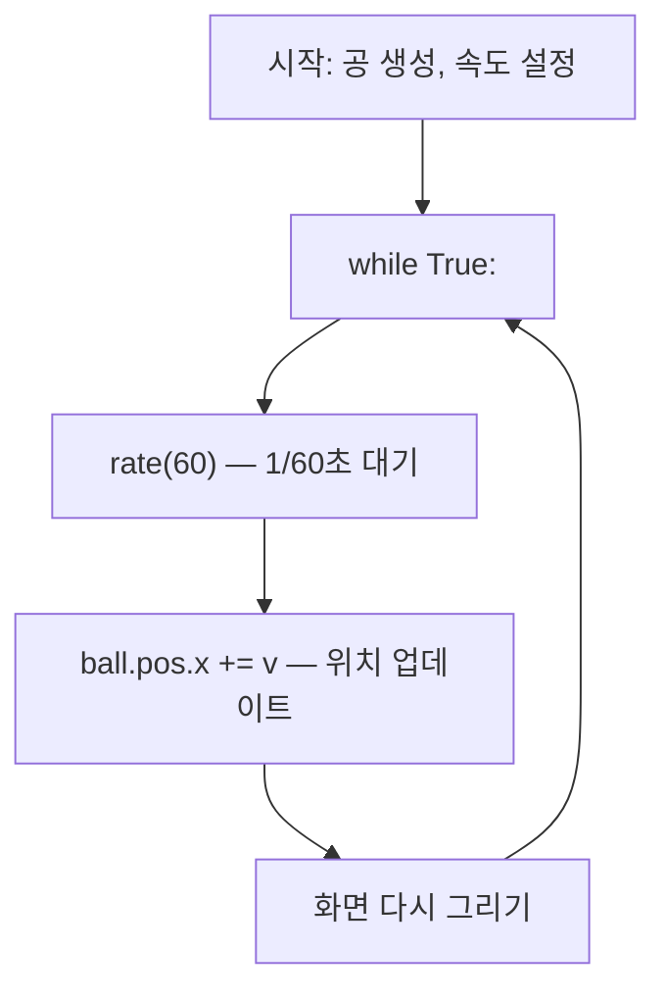

# Ch.6 — 움직여라! 애니메이션의 원리

**Part 2: 변화와 움직임** | 핵심: `while True`, `rate()`, `velocity`

---

## 🎬 오늘의 장면

지금까지 우리가 만든 세계는 전부 **정지 화면**이었습니다.

공을 만들었지만, 가만히 서 있었죠. 상자를 만들었지만, 꼼짝도 안 했죠. 랜덤으로 뿌려도 한 번 배치되면 끝이었습니다.

오늘, 드디어 **움직입니다.**

빨간 공 하나가 왼쪽에서 오른쪽으로 부드럽게 굴러갑니다. 누가 밀지도 않았는데, 스스로 미끄러지듯 이동합니다.

```python
GlowScript 3.2 VPython

ball = sphere(pos=vector(-5, 0, 0), radius=0.5, color=color.red)

while True:
    rate(60)
    ball.pos.x = ball.pos.x + 0.1
```

아래 장면을 확인해 보세요. 빨간 공, 파란 공, 초록 공이 각자의 방향으로 움직입니다!

<div class="glowscript-demo" markdown>
<div class="demo-label">3개의 공이 각자 다른 방향으로 이동합니다</div>
<iframe src="../demos/ch06_scene.html"></iframe>
</div>

이 짧은 코드 안에 애니메이션의 **모든 비밀**이 들어 있습니다. 오늘 그 비밀을 하나씩 풀어볼 거예요.

---

## 🔍 코드 읽기 챌린지

위 코드를 다시 한번 천천히 읽어 봅시다.

**첫 번째 줄**: `ball = sphere(pos=vector(-5, 0, 0), ...)` — 공을 x = -5 위치에 만듭니다. 화면 왼쪽이죠.

**세 번째 줄**: `while True:` — "영원히 반복해라"라는 뜻입니다. 이 아래에 들여쓰기 된 코드가 끝없이 반복됩니다.

**네 번째 줄**: `rate(60)` — 1초에 60번만 실행해라. 이게 없으면 컴퓨터가 미친 듯이 빠르게 돌려서 아무것도 안 보입니다.

**다섯째 줄**: `ball.pos.x = ball.pos.x + 0.1` — 공의 x 좌표를 0.1만큼 오른쪽으로 옮깁니다. 매번, 매 프레임, 0.1씩.

<div class="code-result" markdown>
**실행 결과**: 빨간 공이 x = -5(왼쪽)에서 출발해 오른쪽으로 부드럽게 이동합니다. 한참 뒤 화면 밖으로 사라집니다.
</div>

??? question "생각해 보기: rate(60)이면 1초에 공이 얼마나 이동할까요?"
    1초에 60번 반복, 매번 0.1씩 이동.
    **60 × 0.1 = 6.0** — 1초에 x 방향으로 6만큼 이동합니다!

??? question "rate(60)을 rate(10)으로 바꾸면 어떻게 될까요?"
    1초에 10번만 반복합니다. 같은 0.1씩 이동하니까 **10 × 0.1 = 1.0** — 6배 느려집니다. 그리고 움직임이 뚝뚝 끊겨 보일 거예요.

??? question "0.1을 0.5로 바꾸면?"
    한 번에 0.5씩 이동하니까 **60 × 0.5 = 30.0** — 1초에 30이나 이동합니다. 눈 깜짝할 새에 사라져요!

---

## 🛠️ 직접 만들어보기

### 실험 1: 기본 움직임

가장 단순한 애니메이션부터 시작합시다. 공이 오른쪽으로 이동합니다.

```python
GlowScript 3.2 VPython

ball = sphere(pos=vector(-5, 0, 0), radius=0.5, color=color.red)

while True:
    rate(60)
    ball.pos.x = ball.pos.x + 0.1
```

실행하면 빨간 공이 왼쪽에서 오른쪽으로 굴러갑니다. 한참 지나면 화면 밖으로 사라져요. 지금은 그게 정상입니다! "벽에서 튕기기"는 다음 시간에 배웁니다.

### 실험 2: 속도를 바꿔 보자

`0.1`이라는 숫자가 **속도**를 결정합니다.

```python
GlowScript 3.2 VPython

ball = sphere(pos=vector(-5, 0, 0), radius=0.5, color=color.red)

while True:
    rate(60)
    ball.pos.x = ball.pos.x + 0.02
```

느리죠? 이번에는 `0.02` 대신 `0.3`을 넣어 보세요. 엄청 빨라집니다!

!!! tip "속도의 비밀"
    `ball.pos.x = ball.pos.x + 숫자` 에서 그 **숫자**가 클수록 빠르고, 작을수록 느립니다. 음수를 넣으면? 반대 방향으로 갑니다!

### 실험 3: 방향을 바꿔 보자

x 대신 y를 바꾸면 위아래로 움직입니다. 둘 다 바꾸면 대각선이에요!

```python
GlowScript 3.2 VPython

ball = sphere(pos=vector(0, -5, 0), radius=0.5, color=color.cyan)

while True:
    rate(60)
    ball.pos.y = ball.pos.y + 0.1
```

공이 아래에서 위로 올라갑니다!

이번에는 **대각선**으로 움직여 봅시다.

```python
GlowScript 3.2 VPython

ball = sphere(pos=vector(-5, -5, 0), radius=0.5, color=color.yellow)

while True:
    rate(60)
    ball.pos.x = ball.pos.x + 0.1
    ball.pos.y = ball.pos.y + 0.05
```

오른쪽 위 대각선으로 이동합니다. x와 y의 변화량이 다르면 기울기가 달라져요.

### 실험 4: velocity 변수 도입

매번 숫자를 직접 쓰는 대신, **변수**에 담아 봅시다. 이것을 **속도(velocity)**라고 부릅니다.

```python
GlowScript 3.2 VPython

ball = sphere(pos=vector(-5, 0, 0), radius=0.5, color=color.red)
v = 0.1

while True:
    rate(60)
    ball.pos.x = ball.pos.x + v
```

`v = 0.1` 한 줄만 바꾸면 속도가 바뀝니다. `v = -0.2`로 바꿔 보세요. 왼쪽으로 빠르게 이동합니다!

!!! tip "왜 변수를 쓸까?"
    나중에 "벽에 부딪히면 방향 전환"을 할 때, `v = -v`라고 쓰면 됩니다. 숫자를 직접 쓰면 이게 불가능해요. 변수의 힘이 여기서 빛납니다!

---

## 🔄 역추적 챌린지

결과를 먼저 보여드릴게요. 코드를 직접 만들어 보세요!

**미션**: "초록 공이 위로 올라가면서 점점 커진다"

<div class="code-result" markdown>
**목표 움직임**: 초록 공이 아래쪽에서 시작해 위로 올라가면서, 반지름도 점점 커집니다. `pos.y`와 `radius` 둘 다 매 프레임 증가시키세요!
</div>

??? hint "힌트 1"
    공이 위로 올라간다 → `ball.pos.y`를 매 프레임 증가시키세요.

??? hint "힌트 2"
    점점 커진다 → `ball.radius`도 매 프레임 조금씩 증가시키세요. `ball.radius = ball.radius + 0.01` 처럼요.

??? success "정답 코드"
    ```python
    GlowScript 3.2 VPython

    ball = sphere(pos=vector(0, -5, 0), radius=0.3, color=color.green)

    while True:
        rate(60)
        ball.pos.y = ball.pos.y + 0.05
        ball.radius = ball.radius + 0.01
    ```
    공이 올라가면서 점점 부풀어 오릅니다! 크기 변화도 애니메이션이 됩니다. `pos`뿐만 아니라 `radius`, `color`도 바꿀 수 있어요.

---

## 📖 알고 넘어가기

### 애니메이션 루프의 흐름



이 흐름이 1초에 60번 반복되면서, 공이 부드럽게 움직이는 것처럼 보입니다. 영화의 프레임과 같은 원리예요!

### while True: — 무한 반복문

```python
while True:
    rate(60)
    ball.pos.x = ball.pos.x + 0.1
```

`while True:`는 "조건이 참인 동안 반복해라"라는 뜻입니다. `True`는 항상 참이니까, **영원히 반복**합니다.

이 안에 들어간 코드가 **한 프레임**입니다. 영화가 1초에 24장의 사진을 보여주듯, 우리 프로그램도 1초에 여러 번 화면을 다시 그립니다.

!!! tip "들여쓰기가 중요!"
    `while True:` 다음 줄부터 **들여쓰기**(스페이스 4칸)된 코드만 반복됩니다. 들여쓰기가 안 된 코드는 반복에 포함되지 않아요.

### rate(60) — 속도 조절기

`rate(60)`은 "1초에 최대 60번만 반복해라"라는 명령입니다.

이게 없으면 컴퓨터는 최대 속도로 돌립니다. 너무 빨라서 공이 순간이동처럼 사라지거나, 프로그램이 멈춘 것처럼 보일 수 있어요.

- **`rate(60)`** → 부드러운 애니메이션 (게임 수준)
- **`rate(30)`** → 약간 끊기지만 괜찮음
- **`rate(10)`** → 뚝뚝 끊기는 느낌
- **`rate(1)`** → 1초에 1번. 슬로모션!

### 위치 업데이트 — 애니메이션의 핵심

```
ball.pos.x = ball.pos.x + 0.1
```

이 한 줄이 애니메이션의 전부입니다.

- **왼쪽** `ball.pos.x` = 새로운 위치
- **오른쪽** `ball.pos.x + 0.1` = 지금 위치에서 0.1 더한 값

매 프레임마다 "지금 위치 + 조금"을 반복하면, 공이 부드럽게 이동합니다.

같은 뜻을 더 짧게 쓸 수도 있습니다.

```
ball.pos.x += 0.1
```

`+=`는 "기존 값에 더해라"라는 뜻입니다. 결과는 똑같아요!

---

## 🐛 버그 사냥

세 가지 버그가 숨어 있는 코드를 준비했습니다. 찾아보세요!

### 버그 1

```python
GlowScript 3.2 VPython

ball = sphere(pos=vector(-5, 0, 0), radius=0.5, color=color.red)

while True:
    ball.pos.x = ball.pos.x + 0.1
```

실행하면 공이 안 보이거나, 프로그램이 멈춘 것처럼 보입니다.

??? bug "정답"
    `rate(60)`이 빠져 있습니다! 이게 없으면 컴퓨터가 미친 속도로 돌려서 공이 순식간에 사라지거나, 브라우저가 멈출 수 있어요. `while True:` 바로 다음 줄에 `rate(60)`을 꼭 넣으세요.

### 버그 2

```python
GlowScript 3.2 VPython

ball = sphere(pos=vector(-5, 0, 0), radius=0.5, color=color.red)

while True:
rate(60)
ball.pos.x = ball.pos.x + 0.1
```

에러가 납니다. 뭐가 잘못된 걸까요?

??? bug "정답"
    **들여쓰기**가 없습니다! `while True:` 아래의 코드는 반드시 스페이스 4칸으로 들여쓰기 해야 합니다. `rate(60)`과 `ball.pos.x = ...` 앞에 공백 4칸을 추가하세요.

### 버그 3

```python
GlowScript 3.2 VPython

ball = sphere(pos=vector(-5, 0, 0), radius=0.5, color=color.red)

while True:
    rate(60)
    pos.x = pos.x + 0.1
```

에러 메시지: `pos is not defined`

??? bug "정답"
    `pos.x`가 아니라 `ball.pos.x`입니다! `pos`는 `ball`이라는 객체의 속성이에요. 어떤 공의 위치인지 **주인**을 꼭 써줘야 합니다. 마치 "위치를 바꿔라"가 아니라 "**ball의** 위치를 바꿔라"라고 말하는 거예요.

---

## 💡 상상 챌린지

여러 공이 각자 다른 방향과 속도로 움직이는 장면을 만들어 보세요!

**목표**: 빨간 공은 오른쪽으로, 파란 공은 위로, 노란 공은 대각선으로 움직이는 장면

??? hint "힌트"
    공 3개를 각각 다른 위치에 만들고, `while True:` 안에서 각각의 위치를 다르게 업데이트하면 됩니다. 속도 변수도 각각 다르게 만들어 보세요.

??? success "예시 코드"
    ```python
    GlowScript 3.2 VPython

    red = sphere(pos=vector(-5, 0, 0), radius=0.4, color=color.red)
    blue = sphere(pos=vector(0, -5, 0), radius=0.4, color=color.cyan)
    yellow = sphere(pos=vector(-3, -3, 0), radius=0.4, color=color.yellow)

    v_red = 0.1
    v_blue = 0.08
    v_yellow_x = 0.06
    v_yellow_y = 0.04

    while True:
        rate(60)
        red.pos.x = red.pos.x + v_red
        blue.pos.y = blue.pos.y + v_blue
        yellow.pos.x = yellow.pos.x + v_yellow_x
        yellow.pos.y = yellow.pos.y + v_yellow_y
    ```
    세 공이 동시에, 각자의 길을 갑니다! 속도 변수를 바꿔서 다양한 움직임을 실험해 보세요.

더 도전하고 싶다면, Ch.5에서 배운 `random()`을 활용해 보세요.

??? success "랜덤 속도 버전"
    ```python
    GlowScript 3.2 VPython

    a = sphere(pos=vector(-5, 0, 0), radius=0.3, color=color.red)
    b = sphere(pos=vector(0, -5, 0), radius=0.3, color=color.green)
    c = sphere(pos=vector(3, 3, 0), radius=0.3, color=color.blue)

    va = random() * 0.2
    vb = random() * 0.2
    vc = random() * 0.2 - 0.1

    while True:
        rate(60)
        a.pos.x = a.pos.x + va
        b.pos.y = b.pos.y + vb
        c.pos.x = c.pos.x + vc
    ```
    실행할 때마다 속도가 달라집니다! `random()`이 매번 다른 값을 만들어내니까요.

---

## 📝 오늘의 완성 코드

오늘 배운 모든 것을 하나로 모은 코드입니다.

```python
GlowScript 3.2 VPython

# 📝 배경색 설정
scene.background = vector(0.9, 0.9, 0.95)

# 📝 공 3개를 서로 다른 위치에 생성
red = sphere(pos=vector(-5, 0, 0), radius=0.5, color=color.red)
blue = sphere(pos=vector(0, -4, 0), radius=0.4, color=color.cyan)
green = sphere(pos=vector(3, 3, 0), radius=0.3, color=color.green)

# 📝 각 공의 속도(velocity)를 변수로 설정
v_red = 0.08
v_blue = 0.06
v_green_x = -0.05
v_green_y = -0.03

# 📝 while True: 무한 반복 = 애니메이션 루프
while True:
    # 📝 rate(60): 1초에 60번 반복 (부드러운 움직임)
    rate(60)
    # 📝 매 프레임 위치를 조금씩 변경 = 움직임!
    red.pos.x = red.pos.x + v_red
    blue.pos.y = blue.pos.y + v_blue
    green.pos.x = green.pos.x + v_green_x
    green.pos.y = green.pos.y + v_green_y
```

빨간 공은 오른쪽으로, 파란 공은 위로, 초록 공은 왼쪽 아래 대각선으로 이동합니다. 각 공은 결국 화면 밖으로 사라집니다. 아직은 그게 정상이에요!

<div class="glowscript-demo" markdown>
<div class="demo-label">실행 결과 — 3색 공 각자 이동</div>
<iframe src="../demos/ch06_final.html"></iframe>
</div>

---

## ✅ 3줄 정리

!!! tip "오늘 배운 것"
    1. **`while True:`** — 이 안의 코드가 영원히 반복됩니다. 이것이 애니메이션의 심장입니다.
    2. **`rate(60)`** — 1초에 60번만 반복하라는 속도 조절기. 없으면 눈에 안 보여요.
    3. **`ball.pos.x += 0.1`** — 매 프레임 위치를 조금씩 바꾸면, 부드러운 움직임이 됩니다.

---

## 🚀 더 탐험하기

오늘 만든 애니메이션에서 한 가지가 아쉽지 않나요?

공이 화면 밖으로 사라집니다. 멈추지도 않고, 튕기지도 않고, 그냥 사라져요.

"x가 5보다 크면 방향을 바꿔라" — 이런 **조건**을 코드로 쓸 수 있다면 어떨까요?

> **다음 시간**: Ch.7에서는 `if`문을 배웁니다. 지금은 공이 화면 밖으로 사라지죠? "벽에 닿으면 방향을 바꿔라!" — 이 한 줄이 모든 것을 바꿉니다!
