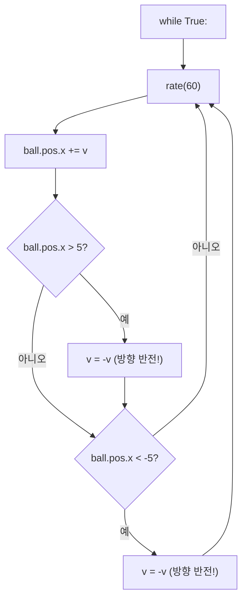

# Ch.7 — 벽에 부딪히면? if문의 탄생

**Part 3: 게임을 향해** | 핵심: `if`, 비교 연산자, `v = -v`

---

## 🎬 오늘의 장면

Ch.6에서 공이 오른쪽으로 끝없이 날아가다 화면 밖으로 사라져 버렸죠?

현실 세계에서 공은 벽에 부딪히면 **튕겨 나옵니다**. 당연하잖아요! 그런데 우리 프로그램의 공은 그걸 모릅니다. 왜냐하면 우리가 "벽에 닿으면 방향을 바꿔!"라고 **알려준 적이 없거든요**.

오늘 배울 `if`문은 바로 그 "만약 ~하면"을 프로그램에게 가르쳐주는 도구입니다.

**오늘의 목표**: 공이 벽에 부딪히면 튕겨 나오게 만들기!

```python
GlowScript 3.2 VPython

ball = sphere(pos=vector(0,0,0), radius=0.3, color=color.cyan)
v = 0.05

while True:
    rate(60)
    ball.pos.x += v
    if ball.pos.x > 5:
        v = -v
```

이 코드를 실행하면 공이 오른쪽으로 가다가 x좌표 5를 넘는 순간... **퐁!** 반대 방향으로 돌아옵니다!

<div class="glowscript-demo" markdown>
<div class="demo-label">벽 4개 사이에서 튕기는 공</div>
<iframe src="../demos/ch07_scene.html"></iframe>
</div>

---

## 🔍 코드 읽기 챌린지

아래 코드를 **실행하지 말고** 눈으로 읽어보세요.

```python
GlowScript 3.2 VPython

ball = sphere(pos=vector(-3,0,0), radius=0.5, color=color.yellow)
v = 0.1

while True:
    rate(60)
    ball.pos.x += v
    if ball.pos.x > 4:
        v = -v
```

<div class="code-result" markdown>
**실행 결과**: 노란 공이 x = -3(왼쪽)에서 출발해 오른쪽으로 이동하다가, x = 4 부근에서 방향이 바뀌어 왼쪽으로 돌아갑니다. 하지만 왼쪽 벽이 없어서 그대로 사라집니다.
</div>

??? question "Q1. 공은 어디서 출발하나요?"
    `pos=vector(-3,0,0)`이니까 **x = -3** 지점, 화면 왼쪽에서 출발합니다.

??? question "Q2. 공은 어느 방향으로 움직이나요?"
    `v = 0.1`이고 `ball.pos.x += v`이니까 x가 점점 커집니다. **오른쪽**으로 이동!

??? question "Q3. 공이 방향을 바꾸는 조건은 무엇인가요?"
    `if ball.pos.x > 4:` — 공의 x좌표가 **4보다 클 때** 방향을 바꿉니다.

??? question "Q4. `v = -v`는 무슨 뜻인가요?"
    `v`가 0.1이었다면 `-v`는 -0.1이 됩니다. 속도가 **반대**가 되니까 방향이 뒤집히는 거예요!

??? question "Q5. 공이 왼쪽 끝까지 가면 어떻게 되나요?"
    왼쪽에 대한 `if`문이 없으니까... 공은 왼쪽으로 **영원히 사라집니다**. 아직 벽이 한 쪽뿐이거든요!

---

## 🛠️ 직접 만들어보기

### 단계 1: 오른쪽 벽 하나

가장 간단한 것부터 시작합시다. 오른쪽 벽 하나만 세워볼게요.

```python
GlowScript 3.2 VPython

ball = sphere(pos=vector(0,0,0), radius=0.3, color=color.cyan)
v = 0.05

while True:
    rate(60)
    ball.pos.x += v
    if ball.pos.x > 5:
        v = -v
```

실행해보세요. 공이 오른쪽으로 가다가 x = 5 근처에서 **퐁!** 돌아옵니다. 그런데 돌아온 뒤 왼쪽으로 사라져버리죠? 왼쪽 벽도 세워야 합니다!

### 단계 2: 양쪽 벽 (좌우 튕기기)

`if`문을 하나 더 추가하면 됩니다.

```python
GlowScript 3.2 VPython

ball = sphere(pos=vector(0,0,0), radius=0.3, color=color.cyan)
v = 0.05

while True:
    rate(60)
    ball.pos.x += v
    if ball.pos.x > 5:
        v = -v
    if ball.pos.x < -5:
        v = -v
```

오른쪽 벽(x > 5)에서도 튕기고, 왼쪽 벽(x < -5)에서도 튕깁니다. 이제 공이 좌우로 왔다갔다 **영원히** 튕깁니다!

### 단계 3: 사방으로 튕기기 (상하좌우)

이번엔 y축 속도도 추가해서 공을 대각선으로 움직여봅시다.

```python
GlowScript 3.2 VPython
ball = sphere(pos=vector(0,0,0), radius=0.3, color=color.cyan)
vx = 0.05
vy = 0.03
while True:
    rate(60)
    ball.pos.x += vx
    ball.pos.y += vy
    if ball.pos.x > 5: vx = -vx
    if ball.pos.x < -5: vx = -vx
    if ball.pos.y > 4: vy = -vy
    if ball.pos.y < -4: vy = -vy
```

공이 대각선으로 날아다니면서 상하좌우 벽에 부딪힐 때마다 **퐁퐁** 튕깁니다! DVD 로고 화면보호기 같지 않나요?

!!! tip "변수 이름을 바꾼 이유"
    x방향 속도와 y방향 속도를 따로 관리해야 하니까, `v` 대신 `vx`와 `vy`로 나눴습니다. x방향에서 튕기면 `vx`만 반전, y방향에서 튕기면 `vy`만 반전!

---

## 🔄 역추적 챌린지

아래 코드의 실행 결과를 **머릿속으로** 따라가 보세요.

```python
GlowScript 3.2 VPython

ball = sphere(pos=vector(4,0,0), radius=0.3, color=color.red)
v = 0.1

while True:
    rate(60)
    ball.pos.x += v
    if ball.pos.x > 5:
        v = -v
    if ball.pos.x < -5:
        v = -v
```

<div class="code-result" markdown>
**실행 결과**: 빨간 공이 x = 4에서 출발해 오른쪽으로 이동 → 약 10프레임 후 x = 5 도달 → 방향 반전 → 왼쪽으로 이동 → x = -5에서 다시 반전 → 영원히 왕복!
</div>

??? question "공의 시작 위치는 어디인가요?"
    `pos=vector(4,0,0)` — x = 4에서 출발합니다. 오른쪽 벽(x = 5)에 꽤 가까운 위치예요.

??? question "공이 처음 벽에 닿기까지 몇 프레임 걸릴까요?"
    시작이 x = 4이고, 매 프레임 0.1씩 증가합니다. 약 **10프레임** 후에 x > 5가 되어 방향이 바뀝니다.

??? question "방향이 바뀐 뒤 v의 값은?"
    `v = -v`이므로 0.1이 **-0.1**이 됩니다. 이제 왼쪽으로 이동!

??? question "공은 앞으로 어떻게 움직일까요?"
    오른쪽 벽(5)과 왼쪽 벽(-5) 사이를 **계속 왕복**합니다. 속도는 0.1로 동일하고 방향만 계속 바뀌어요.

---

## 📖 알고 넘어가기

### 벽 튕기기의 흐름



`if`문이 **문지기** 역할을 합니다. 매 프레임마다 "벽을 넘었나?" 확인하고, 넘었으면 방향을 바꿔주는 거예요!

### `if`문이란?

`if`는 "만약 ~하면"이라는 뜻입니다. 조건이 **참(True)**일 때만 안쪽 코드를 실행합니다.

```python
if ball.pos.x > 5:
    v = -v
```

이 코드를 우리말로 읽으면: "만약 공의 x좌표가 5보다 크면, 속도를 반대로 바꿔라"

!!! tip "들여쓰기가 중요해요"
    `if` 다음 줄에 **공백 4칸**(또는 탭 1번)으로 들여쓴 부분이 "조건이 참일 때 실행할 코드"입니다. 들여쓰기를 빠뜨리면 조건과 상관없이 항상 실행되어 버려요!

### 비교 연산자 6가지

조건을 만들 때 쓰는 기호들입니다.

- **`>`** — ~보다 크다 (예: `x > 5`)
- **`<`** — ~보다 작다 (예: `x < -5`)
- **`>=`** — ~보다 크거나 같다 (예: `x >= 5`)
- **`<=`** — ~보다 작거나 같다 (예: `x <= -5`)
- **`==`** — 같다 (예: `x == 0`) — 등호 **두 개**!
- **`!=`** — 같지 않다 (예: `x != 0`)

!!! bug "초보자 함정: `=`와 `==`"
    `=`는 **값을 넣는 것** (대입), `==`는 **같은지 비교하는 것**입니다. `if x = 5:`는 에러! `if x == 5:`가 맞습니다.

### `v = -v`의 비밀

이 한 줄이 바로 "튕기기"의 핵심입니다.

- `v`가 **양수**(0.05)이면 → `-v`는 **음수**(-0.05) → 왼쪽으로!
- `v`가 **음수**(-0.05)이면 → `-v`는 **양수**(0.05) → 오른쪽으로!

부호가 바뀌면 방향이 바뀝니다. 간단하지만 강력한 트릭이에요!

---

## 🐛 버그 사냥

### 버그 1: 들여쓰기 실종

```python
GlowScript 3.2 VPython

ball = sphere(pos=vector(0,0,0), radius=0.3, color=color.cyan)
v = 0.05

while True:
    rate(60)
    ball.pos.x += v
    if ball.pos.x > 5:
    v = -v
```

??? hint "힌트"
    `if` 아래의 코드가 들여쓰기되어 있나요?

??? success "정답"
    `v = -v`가 `if` 안에 들어가야 하는데 들여쓰기가 없습니다! `if ball.pos.x > 5:` 다음 줄에 **공백 4칸**을 넣어 `    v = -v`로 고쳐야 합니다.

### 버그 2: 한쪽만 튕기는 공

```python
GlowScript 3.2 VPython

ball = sphere(pos=vector(0,0,0), radius=0.3, color=color.green)
v = 0.05

while True:
    rate(60)
    ball.pos.x += v
    if ball.pos.x > 5:
        v = -v
```

??? hint "힌트"
    오른쪽 벽은 있는데... 왼쪽 벽은요?

??? success "정답"
    왼쪽 벽에 대한 `if`문이 빠져 있습니다! 아래 코드를 추가해야 합니다:
    ```python
    if ball.pos.x < -5:
        v = -v
    ```

### 버그 3: 등호의 함정

```python
GlowScript 3.2 VPython

ball = sphere(pos=vector(0,0,0), radius=0.3, color=color.red)
v = 0.05

while True:
    rate(60)
    ball.pos.x += v
    if ball.pos.x = 5:
        v = -v
```

??? hint "힌트"
    `=`와 `==`의 차이를 기억하세요!

??? success "정답"
    `ball.pos.x = 5`는 **대입**(값을 넣는 것)입니다. **비교**를 하려면 `==`을 써야 합니다. 하지만 실제로는 소수점 움직임이라 정확히 5가 되기 어려우므로, `ball.pos.x > 5`처럼 **부등호**를 쓰는 것이 더 안전합니다!

---

## 💡 상상 챌린지

### 도전 1: 눈에 보이는 벽 세우기

지금은 보이지 않는 벽에서 공이 튕기고 있죠? 벽을 실제로 그려봅시다!

```python
GlowScript 3.2 VPython

wall_R = box(pos=vector(5.5,0,0), size=vector(0.2,10,0.2), color=color.white)
wall_L = box(pos=vector(-5.5,0,0), size=vector(0.2,10,0.2), color=color.white)

ball = sphere(pos=vector(0,0,0), radius=0.3, color=color.cyan)
v = 0.05

while True:
    rate(60)
    ball.pos.x += v
    if ball.pos.x > 5:
        v = -v
    if ball.pos.x < -5:
        v = -v
```

이제 하얀 벽 사이에서 공이 튕기는 게 **눈으로** 보입니다!

### 도전 2: 영역마다 배경색 다르게

공이 오른쪽에 있으면 파란 배경, 왼쪽에 있으면 빨간 배경으로 바꿔봅시다!

```python
GlowScript 3.2 VPython
scene.background = color.black
ball = sphere(pos=vector(0,0,0), radius=0.3, color=color.white)
v = 0.05
while True:
    rate(60)
    ball.pos.x += v
    if ball.pos.x > 5:
        v = -v
    if ball.pos.x < -5:
        v = -v
    if ball.pos.x > 0:
        scene.background = vector(0, 0, 0.3)
    if ball.pos.x < 0:
        scene.background = vector(0.3, 0, 0)
```

`if`문이 튕기기 말고도 다양한 곳에 쓰일 수 있다는 걸 느끼셨나요? 조건만 다르게 걸면 뭐든 가능합니다!

### 도전 3: 속도가 점점 빨라지는 공

벽에 부딪힐 때마다 살짝 빨라지게 만들어봅시다.

```python
GlowScript 3.2 VPython

ball = sphere(pos=vector(0,0,0), radius=0.3, color=color.orange)
v = 0.02

while True:
    rate(60)
    ball.pos.x += v
    if ball.pos.x > 5:
        v = -v
        v = v * 1.1
    if ball.pos.x < -5:
        v = -v
        v = v * 1.1
```

??? question "왜 점점 빨라질까요?"
    벽에 튕길 때마다 `v = v * 1.1`로 속도의 절대값이 1.1배씩 커집니다. `v`가 -0.02였다면 반전 후 0.02가 되고, 1.1을 곱하면 0.022가 됩니다. 점점 무서운 속도가 돼요!

---

## 📝 오늘의 완성 코드

사방에서 튕기는 공, 벽까지 완비된 최종 버전입니다!

**장면 설정** — 벽 4개 + 공 + 속도:

```python
GlowScript 3.2 VPython
# 📝 WHAT: 상하좌우 벽 4개 / WHY: 경계를 눈으로 보여주기 위해
wall_R = box(pos=vector(6,0,0), size=vector(0.2,10,0.2), color=color.white)
wall_L = box(pos=vector(-6,0,0), size=vector(0.2,10,0.2), color=color.white)
wall_T = box(pos=vector(0,5,0), size=vector(12,0.2,0.2), color=color.white)
wall_B = box(pos=vector(0,-5,0), size=vector(12,0.2,0.2), color=color.white)
# 📝 WHAT: 공과 속도 / WHY: 대각선 이동을 위해 vx, vy 분리
ball = sphere(pos=vector(0,0,0), radius=0.3, color=color.cyan)
vx = 0.05
vy = 0.03
```

**애니메이션 루프** — 이동 + 충돌 검사:

```python
# 📝 WHAT: 애니메이션 루프 (위 코드에 이어서)
while True:
    rate(60)
    ball.pos.x += vx  # 📝 x방향 이동
    ball.pos.y += vy  # 📝 y방향 이동
    # 📝 WHAT: 벽 충돌 검사 / WHY: 경계 넘으면 속도 반전
    if ball.pos.x > 5.5:  vx = -vx
    if ball.pos.x < -5.5: vx = -vx
    if ball.pos.y > 4.5:  vy = -vy
    if ball.pos.y < -4.5: vy = -vy
```

<div class="glowscript-demo" markdown>
<div class="demo-label">실행 결과 — 사방 벽 튕기기</div>
<iframe src="../demos/ch07_final.html"></iframe>
</div>

---

## ✅ 3줄 정리

!!! tip "오늘 배운 것"
    1. **`if 조건:`** — "만약 ~하면" 조건이 참일 때만 들여쓰기된 코드를 실행한다
    2. **비교 연산자** — `>`, `<`, `>=`, `<=`, `==`, `!=` 으로 조건을 만든다
    3. **`v = -v`** — 속도의 부호를 바꾸면 방향이 반전된다 (벽 튕기기의 핵심!)

---

## 🚀 더 탐험하기

??? success "도전 과제 1: 공 2개 동시에 튕기기"
    `ball2`를 하나 더 만들고, 속도도 `vx2`, `vy2`로 따로 만들어보세요. 두 공이 각자 다른 방향으로 날아다니는 장면을 만들 수 있습니다!

??? success "도전 과제 2: 벽에 닿을 때 공 색깔 바꾸기"
    `if ball.pos.x > 5.5:` 안에 `vx = -vx`뿐만 아니라 `ball.color = color.red`도 넣어보세요. 벽마다 다른 색으로 바꾸면 멋진 효과가 나옵니다!

??? success "도전 과제 3: 중력 효과 흉내내기"
    `vy`를 매 프레임마다 조금씩 줄여보세요: `vy = vy - 0.001`. 공이 위로 올라갔다가 점점 느려지고, 아래로 떨어지는 포물선 운동을 만들 수 있습니다!

> **다음 시간**: Ch.8에서는 **키보드로 물체를 조종**합니다! 화살표 키를 누르면 공이 움직이는 진짜 게임의 시작!
