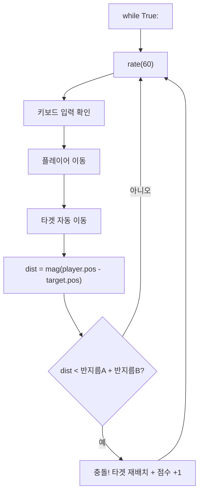

# Ch.9 — 충돌 감지

**Part 3: 게임을 향해** | 핵심: `mag()`, 거리 판단, 충돌 반응

---

## 🎬 오늘의 장면

키보드로 파란 공을 움직여서 빨간 목표 공에 "닿으면" 점수를 올리는 미니 게임입니다.

그런데 잠깐 — 컴퓨터는 "닿았다"를 어떻게 알까요?

우리 눈에는 두 공이 겹치면 "부딪혔네!"라고 바로 보입니다. 하지만 컴퓨터에게 "겹침"이란 개념은 없어요. 컴퓨터가 아는 건 오직 **숫자**뿐입니다.

두 공 사이의 **거리**를 재서, 그 거리가 충분히 가까우면 "충돌!"이라고 판단합니다. 오늘은 이 아이디어를 코드로 만들어 봅니다.

<div class="glowscript-demo" markdown>
<div class="demo-label">화살표 키로 파란 공을 움직여 빨간 공을 잡으세요!</div>
<iframe src="../demos/ch09_scene.html"></iframe>
</div>

---

## 🔍 코드 읽기 챌린지

아래 코드를 먼저 읽어 보세요. 실행하지 말고, 머릿속으로 어떤 장면이 나올지 상상해 보세요.

```python
GlowScript 3.2 VPython

player = sphere(pos=vec(-3,0,0), radius=0.5, color=color.cyan)
target = sphere(pos=vec(3,0,0), radius=0.5, color=color.red)

speed = 0.1

while True:
    rate(60)
    keys = keysdown()
    if 'right' in keys:
        player.pos.x = player.pos.x + speed
    if 'left' in keys:
        player.pos.x = player.pos.x - speed
```

```python
    dist = mag(player.pos - target.pos)
    if dist < player.radius + target.radius:
        target.color = color.green
```

<div class="code-result" markdown>
**실행 결과**: 왼쪽에서 시작한 시안 공을 오른쪽 화살표로 빨간 공 쪽으로 움직이면, 두 공이 닿는 순간 빨간 공이 초록색으로 변합니다.
</div>

??? question "읽기 퀴즈"
    1. `player`는 어디에서 시작하나요?
    2. `target`은 어디에 있나요?
    3. `mag(player.pos - target.pos)`는 무엇을 계산할까요?
    4. 두 공이 만나면 어떤 일이 일어날까요?

??? success "정답"
    1. x=-3 위치, 왼쪽에서 시작합니다
    2. x=3 위치, 오른쪽에 고정되어 있습니다
    3. 두 공 사이의 **거리**를 계산합니다
    4. target의 색이 초록으로 바뀝니다

이제 핵심 줄을 하나씩 뜯어 봅시다.

`player.pos - target.pos` — 두 위치를 빼면 **벡터**(방향과 길이를 가진 화살표)가 나옵니다.

`mag(...)` — 그 벡터의 **길이**(크기)만 꺼냅니다. 즉, 두 점 사이 거리예요.

`player.radius + target.radius` — 두 공의 반지름을 더한 값입니다. 거리가 이것보다 작으면 두 공이 겹친 거예요!

!!! tip "mag()가 뭔데?"
    `mag`는 magnitude(크기)의 줄임말이에요. `mag(vec(3,4,0))`을 하면 5가 나옵니다 — 피타고라스 정리와 같아요! `sqrt(3*3 + 4*4) = 5`. 어렵게 생각할 필요 없어요. 그냥 **"거리 재는 함수"**라고 기억하면 됩니다.

---

## 🛠️ 직접 만들어보기

### 단계 1: 기본 세팅 — 아직 충돌 없음

GlowScript에 아래 코드를 입력하고 실행해 보세요. 오른쪽 화살표 키로 파란 공을 빨간 공 쪽으로 움직여 보세요.

```python
GlowScript 3.2 VPython

player = sphere(pos=vec(-3,0,0), radius=0.5, color=color.cyan)
target = sphere(pos=vec(3,0,0), radius=0.5, color=color.red)

speed = 0.1

while True:
    rate(60)
    keys = keysdown()
    if 'right' in keys:
        player.pos.x = player.pos.x + speed
    if 'left' in keys:
        player.pos.x = player.pos.x - speed
```

아직 충돌 판단 코드가 없습니다. 공이 겹쳐도 아무 일도 안 일어나요!

### 단계 2: 충돌하면 색 바꾸기

while 루프 안에, 키보드 코드 아래에 이 세 줄을 추가하세요.

```python
    dist = mag(player.pos - target.pos)
    if dist < player.radius + target.radius:
        target.color = color.green
```

실행해서 파란 공을 빨간 공에 닿게 해 보세요. 빨간 공이 초록으로 변하면 성공!

### 단계 3: 충돌 후 아이템 재배치

초록으로 변하기만 하면 재미가 없어요. 충돌하면 target이 랜덤한 위치로 이동하게 바꿔 봅시다.

```python
GlowScript 3.2 VPython

player = sphere(pos=vec(-3,0,0), radius=0.5, color=color.cyan)
target = sphere(pos=vec(3,0,0), radius=0.5, color=color.red)

speed = 0.1

while True:
    rate(60)
    keys = keysdown()
    if 'right' in keys:
        player.pos.x = player.pos.x + speed
    if 'left' in keys:
        player.pos.x = player.pos.x - speed
```

```python
    dist = mag(player.pos - target.pos)
    if dist < player.radius + target.radius:
        target.pos = vec(random()*8-4, random()*6-3, 0)
```

`random()*8-4`는 -4에서 4 사이의 랜덤 숫자를 만듭니다 (Ch.5 복습!). 이제 공을 잡을 때마다 target이 도망가요!

### 단계 4: 상하좌우 이동 + 움직이는 타겟

진짜 게임답게 만들어 봅시다. 플레이어는 상하좌우로 움직이고, 타겟도 자동으로 움직입니다.

```python
GlowScript 3.2 VPython

player = sphere(pos=vec(0,0,0), radius=0.5, color=color.cyan)
target = sphere(pos=vec(3,2,0), radius=0.5, color=color.red)

speed = 0.1
tv = vec(-0.03, 0.02, 0)
```

```python
while True:
    rate(60)
    keys = keysdown()
    if 'right' in keys:
        player.pos.x = player.pos.x + speed
    if 'left' in keys:
        player.pos.x = player.pos.x - speed
    if 'up' in keys:
        player.pos.y = player.pos.y + speed
    if 'down' in keys:
        player.pos.y = player.pos.y - speed
```

```python
    target.pos = target.pos + tv
    if target.pos.x > 5 or target.pos.x < -5:
        tv.x = -tv.x
    if target.pos.y > 4 or target.pos.y < -4:
        tv.y = -tv.y

    dist = mag(player.pos - target.pos)
    if dist < player.radius + target.radius:
        target.pos = vec(random()*8-4, random()*6-3, 0)
```

!!! tip "코드가 두 블록으로 나뉜 이유"
    코드가 길어서 두 블록으로 나눴지만, 실제로는 하나의 while 루프 안에 이어서 작성해야 합니다. 위 블록의 마지막 줄과 아래 블록의 첫 줄이 같은 들여쓰기 레벨이에요.

---

## 🔄 역추적 챌린지

아래 코드의 실행 결과가 주어집니다. 빈칸을 채워 보세요.

```python
GlowScript 3.2 VPython

a = sphere(pos=vec(0,0,0), radius=1)
b = sphere(pos=vec(3,4,0), radius=1)

dist = mag(a.pos - b.pos)
print(dist)

if dist < a.radius + b.radius:
    print("충돌!")
else:
    print("아직 멀었다")
```

실행 결과:

```
5
아직 멀었다
```

??? question "역추적 문제"
    1. `a.pos - b.pos`는 어떤 벡터인가요?
    2. `mag(vec(-3,-4,0))`은 왜 5인가요?
    3. `a.radius + b.radius`는 얼마인가요?
    4. 5 < 2 는 참인가요 거짓인가요?
    5. b를 어디로 옮기면 충돌이 일어날까요?

??? success "정답"
    1. `vec(0,0,0) - vec(3,4,0)` = `vec(-3,-4,0)`
    2. `sqrt((-3)*(-3) + (-4)*(-4))` = `sqrt(9+16)` = `sqrt(25)` = 5
    3. 1 + 1 = 2
    4. 거짓입니다 (5는 2보다 크니까요)
    5. `b.pos = vec(1,0,0)` 같이 a에서 거리 2 미만인 곳이면 됩니다

---

## 📖 알고 넘어가기

**mag() — 거리를 재는 함수**

`mag()`는 벡터의 "크기"를 숫자로 돌려줍니다. 두 물체 사이 거리를 잴 때 이렇게 씁니다:

```
거리 = mag(물체A.pos - 물체B.pos)
```

**충돌 판단 공식**

두 구가 겹치는지 확인하는 조건입니다:

```
거리 < 반지름A + 반지름B
```

이게 참이면 두 구의 표면이 겹친 거예요. 거리가 두 반지름의 합보다 작다는 건, 두 구 사이에 빈 공간이 없다는 뜻이에요.

!!! tip "왜 반지름의 '합'인가?"
    구A의 중심에서 표면까지가 반지름A, 구B도 마찬가지입니다. 두 구가 딱 맞닿으려면 중심 사이 거리가 정확히 `반지름A + 반지름B`여야 해요. 그보다 가까우면? 겹친 거예요!



**충돌 시 할 수 있는 일들**

충돌을 감지한 뒤에는 원하는 반응을 코드로 만들면 됩니다:

- 색 바꾸기: `target.color = color.green`
- 위치 리셋: `target.pos = vec(random()*8-4, 0, 0)`
- 크기 바꾸기: `target.radius = target.radius + 0.1`
- 속도 바꾸기: `speed = speed + 0.01`

---

## 🐛 버그 사냥

아래 코드에는 버그가 3개 숨어 있습니다. 찾아서 고쳐 보세요.

```python
GlowScript 3.2 VPython

player = sphere(pos=vec(0,0,0), radius=0.5, color=color.cyan)
target = sphere(pos=vec(4,0,0), radius=0.5, color=color.red)

while True:
    rate(60)
    keys = keysdown()
    if 'right' in keys:
        player.pos.x = player.pos.x + 0.1

    dist = mag(player.pos + target.pos)
    if dist < player.radius:
        target.color = color.green
```

??? hint "힌트 1"
    거리를 구할 때 두 위치를 **더하면** 안 됩니다. 두 점 사이의 벡터는 **빼기**로 구해요.

??? hint "힌트 2"
    충돌 조건에서 **한쪽** 반지름만 비교하고 있어요. 두 공 모두의 반지름을 고려해야 합니다.

??? hint "힌트 3"
    player가 오른쪽으로만 움직여요. 왼쪽 키 처리가 빠졌습니다!

??? success "수정된 코드"
    **버그 1**: `mag(player.pos + target.pos)` → `mag(player.pos - target.pos)` (더하기를 빼기로)

    **버그 2**: `dist < player.radius` → `dist < player.radius + target.radius` (두 반지름의 합)

    **버그 3**: 왼쪽 이동 코드 누락 — `if 'left' in keys:` 블록 추가 필요

---

## 💡 상상 챌린지

코드를 바꾸지 않고 **머릿속으로만** 생각해 보세요.

??? question "상상 1: 반지름을 아주 크게 하면?"
    `player.radius = 3`, `target.radius = 3`으로 바꾸면 어떻게 될까요? 두 공의 반지름 합이 6이 되니까, 거리가 6보다 작기만 하면 충돌이에요. 시작부터 "충돌!" 상태일 수도 있지 않을까요?

??? question "상상 2: 반지름을 아주 작게 하면?"
    `radius=0.01`로 하면? 거의 점처럼 보이는 두 공이 정확히 같은 위치에 와야 충돌이 됩니다. 게임이 매우 어려워져요!

??? question "상상 3: mag() 없이 충돌 감지를?"
    만약 `mag()`가 없다면 직접 거리를 계산할 수 있을까요? `player.pos.x - target.pos.x`로 x 차이를 구하고, y 차이도 구해서 피타고라스 정리를 쓰면... 가능하긴 하지만 `mag()`가 훨씬 편합니다!

??? question "상상 4: 세 번째 공을 추가하면?"
    target2를 하나 더 만들면요? `mag(player.pos - target2.pos) < ...`로 두 번째 충돌 조건도 추가하면 됩니다. 아이템을 여러 개 만들 수 있어요!

---

## 📝 오늘의 완성 코드

Ch.9에서 만든 최종 버전입니다. 키보드로 플레이어를 움직이고, 움직이는 타겟을 잡으면 새 위치로 이동하는 게임이에요.

```python
GlowScript 3.2 VPython

# WHAT: 게임 공간 바닥
ground = box(pos=vec(0,-4.5,0), size=vec(12,0.2,0.5), color=color.white)

# WHAT: 플레이어 (키보드로 조종)
player = sphere(pos=vec(0,0,0), radius=0.5, color=color.cyan)
# WHAT: 목표 아이템
target = sphere(pos=vec(3,2,0), radius=0.4, color=color.red)
```

```python
# WHY: 플레이어와 타겟의 이동 속도를 따로 관리
speed = 0.1
tv = vec(-0.03, 0.02, 0)

# WHAT: 점수 표시 라벨
score = 0
info = label(pos=vec(0,4.5,0), text="점수: 0")
```

```python
while True:
    rate(60)

    # WHAT: 키보드 입력으로 플레이어 이동
    keys = keysdown()
    if 'right' in keys:
        player.pos.x = player.pos.x + speed
    if 'left' in keys:
        player.pos.x = player.pos.x - speed
    if 'up' in keys:
        player.pos.y = player.pos.y + speed
    if 'down' in keys:
        player.pos.y = player.pos.y - speed
```

```python
    # WHAT: 타겟 자동 이동 + 벽 튕기기
    target.pos = target.pos + tv
    if target.pos.x > 5 or target.pos.x < -5:
        tv.x = -tv.x
    if target.pos.y > 4 or target.pos.y < -4:
        tv.y = -tv.y

    # WHAT: 충돌 판단 — 거리가 반지름 합보다 작으면
    # WHY: mag()로 두 점 사이 거리를 계산
    dist = mag(player.pos - target.pos)
    if dist < player.radius + target.radius:
        # WHY: 충돌 시 타겟을 랜덤 위치로 재배치
        target.pos = vec(random()*8-4, random()*6-3, 0)
        score = score + 1
        info.text = "점수: " + str(score)
```

!!! tip "코드 블록이 나뉘어 있지만"
    위 네 블록은 하나의 연속된 코드입니다. 처음 두 블록은 while 바깥(초기 설정), 나머지 두 블록은 while 안에 이어서 작성하면 됩니다.

<div class="glowscript-demo" markdown>
<div class="demo-label">실행 결과 — 충돌 감지 게임</div>
<iframe src="../demos/ch09_final.html"></iframe>
</div>

---

## ✅ 3줄 정리

!!! tip "오늘 배운 것"
    1. **`mag(a.pos - b.pos)`** 는 두 물체 사이의 거리를 숫자로 돌려줍니다
    2. **거리 < 반지름A + 반지름B** 이면 두 구가 겹친 것 → 충돌!
    3. 충돌을 감지하면 색 변경, 위치 리셋, 점수 추가 등 **원하는 반응**을 만들 수 있어요

---

## 🚀 더 탐험하기

??? challenge "도전 1: 제한 시간 추가"
    `t = 0`으로 시작해서 매 프레임 `t = t + 1/60`으로 시간을 세 보세요. `if t > 30:`이면 게임 종료 메시지를 표시해 보세요. 30초 안에 몇 점을 딸 수 있을까요?

??? challenge "도전 2: 장애물 추가"
    `obstacle = sphere(pos=vec(0,2,0), radius=0.8, color=color.yellow)`을 만들고, 이것도 움직이게 해 보세요. 플레이어가 장애물에 닿으면 점수가 깎이게 하면 어떨까요?

??? challenge "도전 3: 아이템 크기 변화"
    잡을 때마다 `target.radius = target.radius - 0.05`로 타겟을 점점 작게 만들어 보세요. 점수가 올라갈수록 게임이 어려워져요!

---

> **다음 시간**: Ch.10은 **미니 프로젝트** 시간입니다! Ch.4~9에서 배운 모든 것을 조합해서 나만의 게임을 만듭니다. 설계 → 구현 → 테스트, 진짜 개발자처럼!
