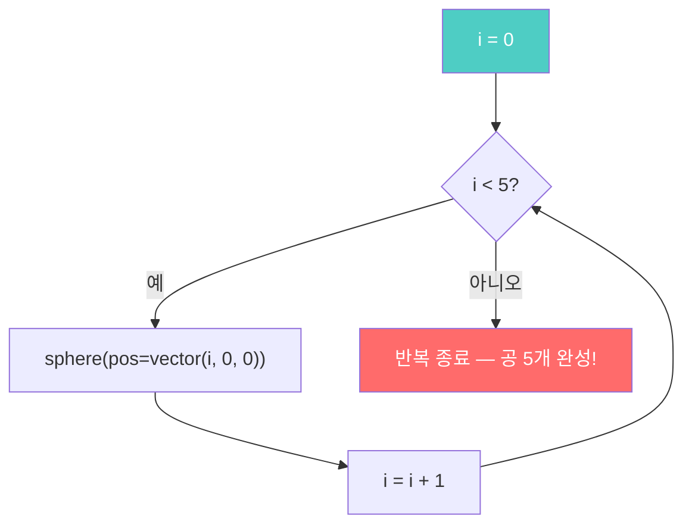

# Ch.11 — for 반복문: 패턴의 힘

**Part 4: 패턴과 구조** | 핵심: `for`, `range()`

---

## 🎬 오늘의 장면

5행 5열, 총 25개의 공이 격자 모양으로 깔끔하게 정렬되어 있습니다.
모든 공의 색이 조금씩 다릅니다 — 위치에 따라 자동으로 그라데이션!
마우스로 돌려 보면, 평평한 바닥판처럼 펼쳐진 무지개 격자가 보여요.

<div class="glowscript-demo" markdown>
<div class="demo-label">마우스로 돌려보세요!</div>
<iframe src="../demos/ch11_scene.html"></iframe>
</div>

**이 장면은 코드 단 4줄로 만들었습니다.**

Ch.5에서 공 10개를 만들려고 코드 10줄을 복사-붙여넣기 한 적 있죠?
`for`를 배우면, 25개를 만들어도 코드는 고작 몇 줄이면 충분합니다.

---

## 🔍 코드 읽기 챌린지

아래 코드를 **실행하지 말고** 읽어 보세요.

```python
GlowScript 3.2 VPython
for i in range(5):
    sphere(pos=vector(i, 0, 0), color=color.cyan)
```

??? question "화면에 무엇이 보일까요?"

    **하늘색 공 5개**가 왼쪽에서 오른쪽으로 나란히 나타납니다.

    - `range(5)` → 0, 1, 2, 3, 4를 차례로 만들어 냄
    - `i`가 0일 때 → `vector(0, 0, 0)` → 원점에 공
    - `i`가 1일 때 → `vector(1, 0, 0)` → 오른쪽으로 1
    - `i`가 4일 때 → `vector(4, 0, 0)` → 오른쪽으로 4

    공 5개가 x=0, 1, 2, 3, 4 위치에 한 줄로 놓입니다!

    <div class="scene-preview" style="height: 80px;">
      <div class="obj" style="left: 15%; top: 40%; width: 30px; height: 30px; background: radial-gradient(circle at 35% 35%, #7fecec, #00bcd4);"></div>
      <div class="obj" style="left: 30%; top: 40%; width: 30px; height: 30px; background: radial-gradient(circle at 35% 35%, #7fecec, #00bcd4);"></div>
      <div class="obj" style="left: 45%; top: 40%; width: 30px; height: 30px; background: radial-gradient(circle at 35% 35%, #7fecec, #00bcd4);"></div>
      <div class="obj" style="left: 60%; top: 40%; width: 30px; height: 30px; background: radial-gradient(circle at 35% 35%, #7fecec, #00bcd4);"></div>
      <div class="obj" style="left: 75%; top: 40%; width: 30px; height: 30px; background: radial-gradient(circle at 35% 35%, #7fecec, #00bcd4);"></div>
    </div>

그러면 이건 어떨까요?

```python
GlowScript 3.2 VPython
for i in range(5):
    sphere(pos=vector(i, i, 0), color=color.yellow)
```

??? question "이번에는 어떤 모양이 될까요?"

    **대각선**입니다!

    - `i`가 0 → `vector(0, 0, 0)`
    - `i`가 1 → `vector(1, 1, 0)`
    - `i`가 2 → `vector(2, 2, 0)`

    x와 y가 동시에 커지니까, 왼쪽 아래에서 오른쪽 위로 비스듬히 올라가는 대각선이 됩니다.

---

## 🛠️ 직접 만들어보기

### 실험 1: 공 한 줄 만들기

[glowscript.org](https://glowscript.org)에서 새 프로그램을 만드세요.

```python
GlowScript 3.2 VPython
for i in range(5):
    sphere(pos=vector(i, 0, 0), color=color.red)
```

빨간 공 5개가 한 줄로 나타납니다!

!!! tip "실험: 숫자 바꾸기"

    - `range(5)` → `range(10)`으로 바꿔 보세요. 공이 몇 개가 되나요?
    - `range(20)`으로 바꾸면? 한 줄이 길어집니다!
    - `range(3)`으로 바꾸면? 3개만 나타나요.

    **`range()` 안의 숫자 = 반복 횟수 = 공의 개수**입니다.

---

### 실험 2: 간격 조절하기

공이 너무 붙어 있나요? 간격을 벌려 봅시다.

```python
GlowScript 3.2 VPython
for i in range(10):
    sphere(pos=vector(i * 2, 0, 0), radius=0.4,
           color=color.green)
```

`i * 2` 덕분에 공 사이 간격이 2가 됩니다.

!!! tip "실험: 간격과 크기"

    - `i * 2` → `i * 3`으로 바꾸면? 더 넓어져요.
    - `radius=0.4` → `radius=0.8`로 바꾸면? 공이 커져서 다시 붙어 보여요.
    - 간격과 크기의 관계를 실험해 보세요!

---

### 실험 3: i로 색 바꾸기 — 그라데이션

`i`는 숫자이니까, 색에도 쓸 수 있습니다!

```python
GlowScript 3.2 VPython
for i in range(10):
    sphere(pos=vector(i, 0, 0), radius=0.4,
           color=vector(i/10, 0, 1 - i/10))
```

왼쪽은 파란색, 오른쪽은 빨간색 — 공 10개가 그라데이션을 이룹니다!

!!! tip "실험: 색 공식 바꾸기"

    - `color=vector(i/10, i/10, 0)` → 검정에서 노랑으로
    - `color=vector(1, i/10, 0)` → 빨강에서 노랑으로

    `i`가 0에서 9까지 변하니까, `i/10`은 0.0에서 0.9까지 변합니다.
    이 숫자를 RGB에 넣으면 자동 그라데이션!

---

### 실험 4: 이중 for문 — 2D 격자

여기가 핵심입니다. for 안에 for를 넣으면 **격자**가 됩니다!

```python
GlowScript 3.2 VPython
for x in range(5):
    for y in range(5):
        sphere(pos=vector(x, y, 0), radius=0.4,
               color=color.cyan)
```

5행 5열, 공 25개가 격자 모양으로 나타납니다!

!!! tip "실험: 격자 바꾸기"

    - `range(5)` 둘 다 `range(8)`로 바꾸면? 8 × 8 = 64개!
    - 바깥 `range(5)`만 `range(3)`으로 바꾸면? 3 × 5 = 15개 (직사각형)
    - `color=vector(x/5, y/5, 0)`으로 바꾸면? 위치에 따라 색이 달라져요!

---

## 🔄 역추적 챌린지

이번에는 **거꾸로**. 결과를 보고 코드를 작성해 보세요.

**장면**: 빨간 공 7개가 **세로 한 줄**로 놓여 있습니다. (y 방향)

<div class="scene-preview">
  <div class="obj" style="left: 47%; top: 85%; width: 24px; height: 24px; background: radial-gradient(circle at 35% 35%, #ff6b6b, #c0392b);"></div>
  <div class="obj" style="left: 47%; top: 73%; width: 24px; height: 24px; background: radial-gradient(circle at 35% 35%, #ff6b6b, #c0392b);"></div>
  <div class="obj" style="left: 47%; top: 61%; width: 24px; height: 24px; background: radial-gradient(circle at 35% 35%, #ff6b6b, #c0392b);"></div>
  <div class="obj" style="left: 47%; top: 49%; width: 24px; height: 24px; background: radial-gradient(circle at 35% 35%, #ff6b6b, #c0392b);"></div>
  <div class="obj" style="left: 47%; top: 37%; width: 24px; height: 24px; background: radial-gradient(circle at 35% 35%, #ff6b6b, #c0392b);"></div>
  <div class="obj" style="left: 47%; top: 25%; width: 24px; height: 24px; background: radial-gradient(circle at 35% 35%, #ff6b6b, #c0392b);"></div>
  <div class="obj" style="left: 47%; top: 13%; width: 24px; height: 24px; background: radial-gradient(circle at 35% 35%, #ff6b6b, #c0392b);"></div>
</div>

**생각의 순서**:

1. 공 몇 개? → 7개 → `range(7)`
2. 방향은? → 세로 → y가 바뀌어야 함
3. 색은? → 빨강

??? hint "힌트"

    `pos=vector(0, ???, 0)` — `???` 자리에 무엇을 넣어야 할까요?
    x는 고정(0), y만 i로 바뀌면 세로 줄이 됩니다.

??? success "정답 예시"

    ```python
    GlowScript 3.2 VPython
    for i in range(7):
        sphere(pos=vector(0, i, 0), radius=0.4, color=color.red)
    ```

    `vector(0, i, 0)` — x=0 고정, y=i → 세로 한 줄!

**장면 2**: 초록 공이 3행 3열 격자로 놓여 있습니다.

<div class="scene-preview">
  <div class="obj" style="left: 30%; top: 25%; width: 28px; height: 28px; background: radial-gradient(circle at 35% 35%, #55efc4, #00b894);"></div>
  <div class="obj" style="left: 47%; top: 25%; width: 28px; height: 28px; background: radial-gradient(circle at 35% 35%, #55efc4, #00b894);"></div>
  <div class="obj" style="left: 64%; top: 25%; width: 28px; height: 28px; background: radial-gradient(circle at 35% 35%, #55efc4, #00b894);"></div>
  <div class="obj" style="left: 30%; top: 47%; width: 28px; height: 28px; background: radial-gradient(circle at 35% 35%, #55efc4, #00b894);"></div>
  <div class="obj" style="left: 47%; top: 47%; width: 28px; height: 28px; background: radial-gradient(circle at 35% 35%, #55efc4, #00b894);"></div>
  <div class="obj" style="left: 64%; top: 47%; width: 28px; height: 28px; background: radial-gradient(circle at 35% 35%, #55efc4, #00b894);"></div>
  <div class="obj" style="left: 30%; top: 69%; width: 28px; height: 28px; background: radial-gradient(circle at 35% 35%, #55efc4, #00b894);"></div>
  <div class="obj" style="left: 47%; top: 69%; width: 28px; height: 28px; background: radial-gradient(circle at 35% 35%, #55efc4, #00b894);"></div>
  <div class="obj" style="left: 64%; top: 69%; width: 28px; height: 28px; background: radial-gradient(circle at 35% 35%, #55efc4, #00b894);"></div>
</div>

??? hint "힌트"

    for 안에 for! `range(3)`을 두 번 써 보세요.

??? success "정답 예시"

    ```python
    GlowScript 3.2 VPython
    for x in range(3):
        for y in range(3):
            sphere(pos=vector(x, y, 0), radius=0.4,
                   color=color.green)
    ```

    3 × 3 = 9개의 초록 공이 격자를 이룹니다.

---

## 📖 알고 넘어가기

실험하면서 자연스럽게 배운 것을 정리합시다. 외울 필요 없어요!



!!! note "for문 — 같은 일을 여러 번 반복"

    ```python
    for i in range(횟수):
        반복할 코드
    ```

    - **`range(5)`** → 0, 1, 2, 3, 4 (5개 숫자를 차례로 만듦)
    - **`i`** → 매 반복마다 다른 값이 들어가는 변수
    - **들여쓰기** → 반복할 코드는 반드시 **스페이스 4칸** 들여쓰기

    `range(10)` → 0~9, `range(100)` → 0~99.
    `range(N)` 안의 숫자 = 반복 횟수!

!!! note "이중 for문 — 격자(2D) 만들기"

    ```python
    for x in range(가로):
        for y in range(세로):
            sphere(pos=vector(x, y, 0))
    ```

    - 바깥 for가 1번 돌 때, 안쪽 for가 전부 돕니다
    - 가로 5 × 세로 5 = 공 25개

---

## 🐛 버그 사냥

아래 코드에는 각각 버그가 하나씩 있어요. 찾아서 고쳐 보세요!

!!! bug "버그 1"

    ```python
    GlowScript 3.2 VPython
    for i in range(5)
        sphere(pos=vector(i, 0, 0), color=color.red)
    ```

??? success "정답"

    `for` 줄 끝에 **콜론(`:`)이 빠졌습니다!**

    ```python
    for i in range(5):
        sphere(pos=vector(i, 0, 0), color=color.red)
    ```

    for문의 끝에는 반드시 `:`를 붙여야 합니다.

!!! bug "버그 2"

    ```python
    GlowScript 3.2 VPython
    for i in range(5):
    sphere(pos=vector(i, 0, 0), color=color.blue)
    ```

??? success "정답"

    `sphere(...)` 앞에 **들여쓰기가 없습니다!**

    ```python
    for i in range(5):
        sphere(pos=vector(i, 0, 0), color=color.blue)
    ```

    for 안에서 반복할 코드는 반드시 스페이스 4칸 들여쓰기!

!!! bug "버그 3: 공이 한 곳에 겹쳐요"

    ```python
    GlowScript 3.2 VPython
    for i in range(10):
        sphere(pos=vector(0, 0, 0), radius=0.3,
               color=color.green)
    ```

??? success "정답"

    `pos=vector(0, 0, 0)` — 위치에 `i`를 안 썼습니다!

    ```python
    for i in range(10):
        sphere(pos=vector(i, 0, 0), radius=0.3,
               color=color.green)
    ```

    `i`를 위치에 써야 공이 하나씩 다른 곳에 놓입니다.
    `i`를 안 쓰면 10개가 전부 같은 위치에 겹쳐요!

---

## 💡 상상 챌린지

`for`와 `range()`만으로 무엇을 만들 수 있을까요?

**미션: for 반복문으로 멋진 패턴을 만들어 보세요!**

아이디어:

- **계단** — 공을 계단 모양으로 (x와 y를 동시에 증가)
- **피라미드** — 아래 줄은 넓게, 위로 갈수록 좁게
- **색깔 벽** — 5×5 격자인데 모든 공의 색이 위치에 따라 다르게
- **다이아몬드** — 가운데가 넓고 위아래가 좁은 마름모 모양

**규칙**: for문 사용 필수, 공 10개 이상, 2가지 색 이상. 나머지는 자유!

??? success "예시: 색깔 벽"

    ```python
    GlowScript 3.2 VPython
    for x in range(5):
        for y in range(5):
            sphere(pos=vector(x, y, 0), radius=0.4,
                   color=vector(x/5, y/5, 0.5))
    ```

    x 위치에 따라 빨강이, y 위치에 따라 초록이 변합니다.
    25개 공이 전부 다른 색! 여러분만의 색 공식을 만들어 보세요.

---

## 📝 오늘의 완성 코드

처음에 보여드렸던 **5×5 색깔 격자** 장면입니다.

```python
GlowScript 3.2 VPython
# === WHAT: 5×5 격자, 위치로 색 자동 변화 ===
# === WHY: 이중 for문 + i 활용으로 2D 패턴 ===

for x in range(5):
    for y in range(5):
        sphere(pos=vector(x, y, 0), radius=0.4,
               color=vector(x/5, 1 - y/5, y/5))
```

- `x/5` → x 위치에 따라 빨강 성분이 변합니다
- `1 - y/5` → y 위치에 따라 초록 성분이 변합니다
- `y/5` → y 위치에 따라 파랑 성분도 변합니다
- 5 × 5 = 25개의 공이 모두 다른 색의 격자를 이룹니다!

<div class="glowscript-demo" markdown>
<div class="demo-label">실행 결과 — 5×5 색깔 격자</div>
<iframe src="../demos/ch11_scene.html"></iframe>
</div>

---

## ✅ 3줄 정리

!!! abstract "오늘 배운 것"

    1. **`for i in range(N):`으로 코드를 N번 반복한다** — 복사-붙여넣기는 이제 안녕!
    2. **`i`를 위치/색/크기에 활용하면 패턴이 만들어진다** — 숫자가 곧 패턴
    3. **for 안에 for를 넣으면 2D 격자가 된다** — 1D 줄 → 2D 격자로 확장

---

## 🚀 더 탐험하기

### 탐험 1: 간격과 중심 맞추기

격자를 화면 한가운데에 놓고 싶다면?

```python
GlowScript 3.2 VPython
for x in range(5):
    for y in range(5):
        sphere(pos=vector(x - 2, y - 2, 0),
               radius=0.4, color=vector(x/5, y/5, 0.5))
```

`x - 2`와 `y - 2`로 중심을 (0, 0, 0)에 맞췄습니다.
`range(5)`는 0~4이니까, 2를 빼면 -2~2가 되어 정중앙!

### 탐험 2: 원형 배치

for문으로 공을 **원** 모양으로 배치할 수 있습니다!

```python
GlowScript 3.2 VPython
from vpython import *
N = 20
for i in range(N):
    angle = i * 2 * pi / N
    sphere(pos=vector(3*cos(angle), 3*sin(angle), 0),
           radius=0.3, color=vector(i/N, 0.5, 1-i/N))
```

!!! tip "어떻게 동작하나요?"

    - `cos()`과 `sin()`은 원 위의 좌표를 계산해 줍니다
    - `N = 20` → 공 20개가 원 둘레를 따라 배치
    - `N = 50`으로 바꾸면? 더 촘촘한 원이 됩니다!

### 탐험 3: 3D 큐브 (삼중 for문!)

for를 3번 겹치면 **3D 큐브**를 만들 수 있어요.

```python
GlowScript 3.2 VPython
for x in range(3):
    for y in range(3):
        for z in range(3):
            sphere(pos=vector(x, y, z), radius=0.3,
                   color=vector(x/3, y/3, z/3))
```

3 × 3 × 3 = **27개**의 공이 정육면체 모양을 이룹니다!
마우스로 돌려 보세요 — 진짜 3D 구조입니다.

!!! tip "도전"

    - `range(3)` → `range(5)`로 바꾸면? 5 × 5 × 5 = 125개!
    - `radius=0.3` → `radius=0.1`로 줄이면 공 사이가 벌어져요
    - 정육면체 안에서 색이 3D로 그라데이션 됩니다!

---

> **다음 시간**: Ch.12에서는 **리스트**를 배웁니다. 공 여러 개를 한꺼번에 이름표에 담아서, 나중에 하나씩 꺼내서 움직이거나 색을 바꿀 수 있어요!
