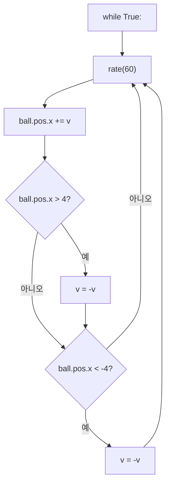
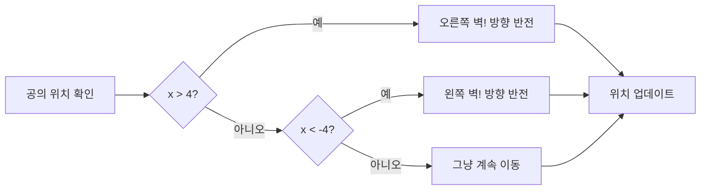

# 시각화 테스트 페이지

이 페이지는 3가지 시각화 방식을 테스트합니다.

---

## 테스트 1: GlowScript iframe 데모

아래에 Ch.1의 4색 공 장면이 라이브로 표시됩니다. 마우스로 회전/확대할 수 있습니다.

<div class="glowscript-demo" markdown>
<div class="demo-label">실행 결과 — 4색 공 나란히</div>
<iframe src="../demos/ch01_scene.html"></iframe>
</div>

---

## 테스트 2: Mermaid 다이어그램

Ch.6 애니메이션 루프의 흐름도입니다.



Ch.7 if문 분기의 흐름도입니다.



---

## 테스트 3: HTML/CSS 장면 미리보기

코드를 실행하지 않아도 결과를 미리 볼 수 있는 정적 미리보기입니다.

### 3-1. 장면 미리보기 (scene-preview)

<div class="scene-preview" markdown>
  <div class="obj" style="left: 20%; top: 45%; width: 50px; height: 50px; background: radial-gradient(circle at 35% 35%, #ff6b6b, #c0392b);">
  </div>
  <div class="obj" style="left: 38%; top: 45%; width: 50px; height: 50px; background: radial-gradient(circle at 35% 35%, #74b9ff, #2980b9);">
  </div>
  <div class="obj" style="left: 56%; top: 45%; width: 50px; height: 50px; background: radial-gradient(circle at 35% 35%, #ffeaa7, #f39c12);">
  </div>
  <div class="obj" style="left: 74%; top: 45%; width: 50px; height: 50px; background: radial-gradient(circle at 35% 35%, #55efc4, #27ae60);">
  </div>
</div>

### 3-2. 코드 결과 블록 (code-result)

```python
GlowScript 3.2 VPython
sphere(pos=vector(-3, 0, 0), color=color.red)
sphere(pos=vector(3, 0, 0), color=color.blue)
```

<div class="code-result" markdown>
**실행 결과**: 빨간 공이 왼쪽(-3)에, 파란 공이 오른쪽(3)에 나타납니다.
가운데는 비어 있고, 두 공 사이 거리는 6입니다.
</div>

### 3-3. 좌표계 다이어그램 (coord-diagram)


